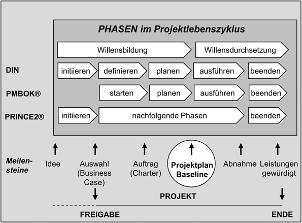

## Projektmanagement verstehen

### Einleitung

Projektmanagement ist allgegenwärtig und gewinnt immer mehr an Bedeutung. 
Dies sieht man bereits daran, dass sich einzelne Studiengänge darauf spezialisieren oder 
komplexe Projekte wie die Mondlandung 1969 nur deshalb stattfinden konnten.  

Wie arbeite ich effizient und effektiv im Team? Wie reduziere ich Kosten, aber erhalte dabei Qualität? Wie verhindere ich Missverständnisse, Verzögerungen oder sogar die vorzeitige Beendigung und den Fehlschlag eines Projekts?  
Auf diese und weitere Fragen gibt das korrekte Projektmanagement eine Antwort.
Im folgenden möchten wir deswegen darauf eingehen, wie man am besten Projektmanagement versteht und Projekte richtig definiert, plant, auf Kurs hält und zu guter letzt abschließt. 
Dabei wurden die Lektüren *Projektmanagement: Von der Defnition über die Projektplanung zum erfolgreichen Abschluss* von Helga Meyer und Heinz-Josef Reher als Basis und *IT-Projektmanagement: Effiziente Einführung in das Management von Projekten* von Christian Aichele und Marius Schönberger und *Projektmanagement im Studium: Vom Projektauftrag bis zur Abschlusspräsentation (2. Auflage)* von Claudia Stöhler als Erweiterungen genutzt.  

### Projekte und ihre Rolle im Produktlebenszyklus
Bevor man jedoch mit dem Management eines Projekts anfangen kann, sollte man verstehen, was Projekte eigentlich sind. Nach der DIN Norm sind sie Vorhaben, die einmalig durch Bedingungen wie Ziel, Zeit, Finanzen, Personelles und weitere Begrenzungen gekennzeichnet sind.  
Des weiteren sind sie von interdisziplinärer Teamarbeit geprägt, denn jeder, der am Projekt teilnimmt, hat unterschiedliche Erfahrungen. Demnach ist Koordination und Arbeitsteilung gefragt. Außerdem gibt es eine gewisse Unsicherheit zu Beginn, die sich aber nach gewissem Fortschritt auflöst, da alles Schritt für Schritt klarer wird.  
Manchmal liegt auch gar kein Projekt vor, d.h. man sollte die Methoden des Projektmanagements nicht anwenden. Ab wann von einem Projekt die Rede ist, definiert eine Organisation für sich selbst ([mehr dazu in Kapitel 2](./Ausarbeitung_EugenKlat.md)).  

Projektmanagement im Detail besteht hauptsächlich aus folgenden Punkten:
-   Spezifikationen, Pläne und Vorgehensweise an die jeweiligen Erwartungen und Anliegen der verschiedenen Stakeholder (= Interessenten und Beteiligte am Projekt) anpassen.
-   Klare und erreichbare Ziele definieren und Anforderungen identifizieren.
-   Termine und Kosten planen und einhalten.
-   Liefergegenstände in der geforderten Qualität liefern.
-   Das Projekt mit Gewinn abschließen.

Die DIN ergänzt dabei einige wenige Punkte:
- Es werden spezielle Techniken und Mittel benutzt.
- Projekte müssen initiiert und gesteuert werden.

#### Product Life Cycle vs. Project Life Cycle
Möchte man das Gesamtbild verstehen, sollte man den Unterschied zwischen *Product Life Cycle* (dt.: Produktlebenszyklus) und *Project Life Cycle* (dt.: Pojektlebenszyklus) kennen:  
Innerhalb der Wirkungsforschung wird der Product Life Cycle mit der Reihenfolge "Idee, Entwicklung, Produktion, Nutzung, Recycling, Entsorgung" beschrieben, bei der der Project Life Cycle meist nur den Anfangsteil, also den Teil bis einschließlich Entwicklung, ausmacht (*Siehe Abb. 1.1*). Ein Projekt kann nämlich bereits abgeschlossen sein, jedoch noch langzeitige Folgen haben. Zum Beispiel das Erbauen eines Stadions und die Durchführung der Olympischen Spiele dort. Die Langzeitfolgen sind dabei ein erheblicher Teil. Wenn also der Product Life Cycle über den Project Life Cycle hinweg dauert, sollte man zukünftige  Entwicklungen und Nutzungsszenarien erahnen wie z.B. Wartungsbedarf.  
Um ein Projekt demnach korrekt planen und umsetzen zu können, ist es wichtig, auf die Projektdauer und auf die Nutzung der Projektergebnisse (im Product Life Cycle) zu achten, und wenn nötig bzw. gewollt die Nachhaltigkeit miteinzubeziehen. Trotzdem gilt dabei jedoch immer: je *weiter* die Planung in die Zukunft reicht, desto *komplexer* und *risikoreicher* wird das Projekt.

Geht man nach Erfolg, so fängt man mit dem Abwicklungserfolg an (*Siehe Abb. 1.1*). Dieser beschreibt den Erfolg in Kosten, Termine, Leistung, also dem technischen, der Anwendungserfolg dann den, den der Nutzer hat, wenn er das Produkt nutzt. Ein Projekt kann also erfolgreich durchgeführt worden sein, trotzdem auf dem Markt nicht funktionieren [[1]](#quelle1).  

  
**Abb. 1.1: Perspektiven des Projekterfolgs**  

### Mit dem magischen Zieldreieck zum Projekterfolg

Nicht immer gelingt ein Projekt, da das Produkt dem Kunden nicht gefällt. Dabei muss man zwischen Kunde und Nutzer unterscheiden, denn diese sind nicht immer identisch. Kunden kann man als Organisation oder einzelne Person definieren. Er muss der Organisation nicht einmal angehören, sondern nur das Produkt empfangen. Beispiele dafür wären:

- Verbraucher
- Endanwender
- Einzelhändler
- Käufer

Ein Kunde ist zufrieden, wenn seine Anforderungen zum möglichst größten Teil erfüllt worden sind. Natürlich muss aber nicht nur der Kunde zufrieden sein, es sollten möglichst alle Beteiligten zufrieden sein. Mithilfe der *Stakeholderanalyse* findet das Team heraus, wem und wie ein Nutzen gebracht werden soll ([mehr dazu in Kapitel 2](https://jonasfhinfo.github.io/SWPM/#/Ausarbeitung/Ausarbeitung_EugenKlat?id=stakeholdermanagement)). 

#### Projekterfolg

Wir gehen noch einmal auf den Erfolg ein, dieses mal aber detaillierter auf den kompletten Projekterfolg. Er basiert auf vier verschiedenen Punkten: Zu einem aus dem Abwicklungserfolg und dem nach dem Projektende stattfindenden Anwendungserfolg, und zum anderen aus der Projekteffizienz und -effektivität (*Siehe Abb. 1.2*).  

  
**Abb. 1.2: Projekterfolg und Projektqualität nach Bea et al.**  

*Projekteffizienz* bedeutet maximalen Output bei minimalen Input zu generieren, also ein Projekt mit möglichst geringem Aufwand in möglichst kurzer Zeit umzusetzen. *Projekteffektivität* hingegen bezieht sich auf das iterative Bewerten des Anwendungserfolgs während das Projekt läuft, d.h. in der Abwicklungszeit. Zum Beispiel würde man sich bei einer Produktentwicklung (intern) auf die Projekteffizienz konzentrieren, bei einem Bauauftrag wiederum auf die Projekteffektivität.  

#### Projektqualität

Des weiteren gibt es noch die Projektqualität (*Siehe Abb. 1.2*). Diese hängt von den Stakeholdern ab, da sie sie wahr nehmen (subjektiv). Ebenso hängt sie davon ab, inwiefern die vorher definierten Ziele im Bezug auf den Projektablauf als auch auf den -gegenstand (das zu entwickelnde System) erreicht wurden (objektiv). Qualität bedeutet also grob gesagt, wie sehr ein Projekt die Erwartungen erfüllt. Dazu darf man jedoch nicht vergessen, dass Langfristwirkungen auch einen Teil ausmachen.  

#### Wie messe ich nun Erfolg und Qualität?

Es ist immer vorteilhaft zu wissen, woran man messen möchte. Zusammen mit dem Auftraggeber sollte man definieren, was seine Anhaltspunkte für Erfolg und Qualität sind, eventuell sind diese ja schon intern vereinheitlicht worden. Das kann nämlich hilfreich für einen stetigen Lernprozess einer projektdurchführenden Organisation sein, denn das Team sollte auch bewertet werden.  
Zwei mögliche Bewertungskonzepte sind das *Dimensionsmodell nach Shenhar und Dvir* und das *Project Excellence Modell der GPM* (Deutsche Gesellschaft für Projektmanagement e. V.) (*Siehe Abb. 1.3*).  

  
**Abb. 1.3: Dimensionsmodell nach Shenhar und Dvir, Project Excellence Modell der GPM**  

In dem Dimensionsmodell existieren fünf verschiedene Dimensionen, wobei jede einzelne eine andere Gewichtung je Projekt besitzt. Problem dabei kann der *Geschäftserfolg* sein, dieser kann bei manchen Projekten erst nach Jahren des Abschlusses bewertet werden. Eben gleiches gilt für die *Vorsorge für die Zukunft*, das wichtig für strategische Projekte sein kann, da Risiken und Chancen auftauchen könnten. Fraglich ist auch, ob Projekte überhaupt immer alle Dimensionen ansprechen können. Daher ist dieses Modell also nicht ganz realitätsnah oder praktisch.  
Das Project Excellence Modell hingegen ist anwendungsbezogener und kann sofort nach dem Abschluss des Projekts zur Bewertung genutzt werden. Dabei werden Punkte verteilt und nach folgenden Kriterien aufgeteilt:  

- Projektprozesse
- Projektergebnisse
- Kunden, Mitarbeiter und weitere Stakeholder
- objektiv gemessene und subjektiv wahrgenommene Zielerfüllung

#### Auftragsklärung

Trotz Regelungen werden Projekte nach ihrem Abschluss oft komplett anders bewertet wie z.B. die Oper in Sidney. Damit dies nicht geschieht, ist es zielführend zu Beginn des Projekts die Auftragsklärung zu verfeinern:

- Kriterien des Projekterfolgs leiten die Handlung und machen Misserfolg erkenntlich
- Kriterien zur Messung des Projekterfolgs müssen Teil der Planung sein
- Messungen überwachen und bewerten

#### Ziele

Ziele sind angestrebte Zustände und machen ebenfalls Bewertung möglich. Anhand ihrer können Beteiligte ihr Handeln ausrichten, sie können dabei helfen, Entscheidungen zu treffen und zeigen, ob man auf dem richtigen Weg ist. Aus Zielen werden später Anforderungen, die von der Leitung und dem Team definiert, umgesetzt und getestet werden. Deshalb gibt es folgende **SMART**-Regeln, die Ziele beschreiben sollen:  

- **S**pezifisch
- **M**essbar
- **A**chievable (erreichbar) oder auch akzeptiert
- **R**ealistisch
- **T**erminiert
  

Außerdem existiert noch das *magische Zieldreieck*, welches ausdrückt, wie Projektmanagement verantwortungsvoll durchgeführt wird (*Siehe Abb. 1.4*). Dabei ist das Optimum die Balance zwischen Leistung (Projektumfang (Scope)), Zeit und Aufwand (Kosten) zu erreichen. Dies kann man auch mit dem Abwicklungserfolg (s.o.) gleichsetzen. 

  
**Abb. 1.4: Das magische Zieldreieck**  

##### Projektumfang

Er beschreibt Produkte, Dienstleistungen, Berichte und Zustände zu Zeitpunkten wie z.B. zum Abschluss des Projekts. Dazu werden Dokumente, manchmal auch resultierend aus Methoden, genutzt.

Dokumente:
- Projektauftrag
- Lastenheft
- Pflichtenheft

Methoden:
- Anforderungsmanagement
- Projektstrukturplanung
- Qualitätsplanung
- Änderungs- und Konfigurationsmanagement

##### Aufwand

Es steht immer eine begrenzte Menge an Einsatzmitteln zur Verfügung. Diese Menge und die Kosten ergeben das Budget, das mit dem Auftraggeber vereinbart wird.

Einsatzmittel:
- Personalaufwand (wichtig)
- Kosten für Material, Maschinen, Reisen, Lizenzen etc.
- Finanzmittel

##### Zeit

Da Zeit ebenfalls immer begrenzt ist, müssen Termine festgelegt werden.

Meilensteine und verschiedene Endtermine:
- Kunde: Liefertermin
- Auftraggeber: Endtermin (mit Abschlussbericht)

Zwischen diesen drei Hauptmerkmalen gibt es noch Austauschbeziehungen bzw. Trade-offs. Projektumfang, Kosten und Termine beeinflussen sich ständig und konkurrieren miteinander. Deshalb sollten Prioritäten gesetzt sein: Was bringt einen größeren Nutzen oder verursacht einen größeren Schaden für das Projekt? Weniger Kosten, aber dafür Termine überschreiten? Früher fertig werden, aber dafür den Umfang reduzieren? Solche fragen sind wichtig, denn sie entscheiden über den Erfolg. Wenn Werbung schon ausgeschildert wird, muss der Termin eingehalten werden oder wenn eine Software erst später released wird, kann sie inaktuell sein und die Konkurrenz bereits im Vorsprung.

### In Etappen zum Erfolg – Phasen und Meilensteine

Die Bewältigung eines Projekts geschieht in Teilstrecken, die auch Phasen genannt werden. Sie besitzen jeweils Hauptaufgaben, die vereinbart werden, und enden mit Übergabepunkten, Meilensteinen. Meilensteine kommen aber nicht nur am Ende von Phasen vor, sondern auch innerhalb. Sie sind definiert durch konkrete Liefergegenstände und einem bestimmten Termin. Überprüft man sie, merkt man, ob noch nachgearbeitet werden muss, bevor es zur nächsten Phase geht. Wichtig ist, wenn man von Meilensteinen spricht, dass diese **nicht** die Aktivität selbst beschreiben, wenn überhaupt nur den Anfang bzw. das Ende. Außerdem sind sogenannte Zahlungsmeilensteine auch von hoher Wichtigkeit, denn diese erbringen Geld beim Erreichen von technischen, also normalen Meilensteinen. Damit ein Projekt nicht scheitert, sollte man diese möglichst einhalten und besonders *Showstopper* verhindern. Showstopper sind nämlich große Probleme, die bis zum Projektstillstand führen können.  
Während der Phasen und Übergänge gibt es immer einen Punkt der Referenz, der gültig ist. Dieser Referenzpunkt, auch *Baseline*, enthält Informationen zum Inhalt zu einem gewissen Zeitpunkt, meist während eines Meilensteins. Man kann sie nicht verändern, jedoch ansehen oder auch deren Stand wiederherstellen.  
Projektmanagement zeichnet aus, dass man vieles vorher gründlich plant und dann ausführt. Daraus resultieren die verschiedenen Phasen mit ihren Aufgaben, damit man bei solch komplexen Projekten den Überblick behält (= Makrostrategie).  
Es existieren viele verschiedene Phasenmodelle, wobei sie sich alle stark ähneln, da sie allgemeine Phasen für Projekte jeglicher Art besitzen (*Siehe Abb. 1.5*) (Projektspezifische Phasen und Meilensteine existieren natürlich ebenfalls).

  
**Abb. 1.5: Phasen im Project Life Cycle**  

#### Initiierungsphase

In dieser Phase soll mithilfe des *Business Case* herausgefunden werden, ob die Idee weiterverfolgt werden oder daraus kein Projekt entstehen soll ([mehr dazu in Kapitel 2](https://jonasfhinfo.github.io/SWPM/#/Ausarbeitung/Ausarbeitung_EugenKlat?id=der-projektauftrag)). Dies wird normalerweise nicht vom Projektleiter oder Team durchgeführt, sondern eher von externen Kunden oder bei internen Projekten vom Management der Organisation.

#### Definitionsphase

Ab hier kommt die Projektleitung und das Team dran. Mit ihnen wird der Projektauftrag erarbeitet und am Ende der Phase genehmigt. Dazu kommt das Managen der Stakeholder und das Verteilen der Rollen im Team.

#### Planungsphase

Es gibt unterschiedliche Arten von Plänen, wovon mindestens einer vorkommen sollte (der Projektplan):

##### Projektplan (Baseline)

Der Projektplan enthält die Basispläne für die Durchführung des Projekts und variiert je nach Art des Projekts. Hauptsächlich geht es um Inhalte, Qualität, Termine, Kosten, Ressourcen und Risiken.

##### Projektmanagementplan

Der Projektmanagementplan ist ein Dokument, worin festgelegt wird, wie Projekt durchgeführt, überwacht und gesteuert wird. Er unterscheidet sich zum Projektplan darin, dass der Fokus auf der Gestaltung des Planungsprozesses liegt. Bei größeren Projekten ist er entscheidend, bei kleineren ist er im Projektplan enthalten.

#### Umsetzungsphase

Um ein Projekt auf Kurs zu halten, gibt es sogenannte *Steuerungsaktivitäten*:

- Arbeit voranbringen, steuern
- ermitteln, welcher Arbeitsfortschritt erreicht wurde
- Tests durchführen
- Ergebnisse prüfen
- Pläne anpassen

Das Ziel der Phase ist, das Produkt fertig zu stellen.

#### Abschlussphase

Die letzte Phase besteht nur darin, das Projekt und die Leistung aller zu bewerten und zu reflektieren. Dazu können Abschlussdokumentationen angefertigt, *Lessons Learnt* angewendet, Ergebnisse archiviert und viele weitere Aktionen durchgeführt werden.  

Für einige Branchen existieren bereits spezifische Phasenpläne, die den gleichen Projektgegenstand beachten wie z.B. im Bau. Gibt es dann auch noch ein Standardphasenmodell, das eine Organisation selbst spezifiziert hat, muss dieses nur noch dem Projekt angepasst werden. Dieses Modell kann dann wiederum zum globalen Qualitätsstandard werden (als Vorgehensmodell), was man z.B. in der Automobilindustrie sehen kann, dort werden u. a. Beschreibungen der Aufgabenfelder im Projektablauf geschildert.

### Den Überblick behalten

Wie kann man im Projekt den Überblick behalten, andererseits das Detail nicht übersehen? Projektmanagementaufgaben während des ganzen Projektablaufs sind bei richtiger Anwendung eine Antwort darauf. Diese Aufgaben werden auch *Kernprozesse* genannt. Zu den Beispiel-Kernprozessen gehören Risiko und Chancenmanagement, Stakeholdermanagement, Qualitätsmanagement, Teambildung und viele weitere (*Siehe Abb. 1.6*).  

  
**Abb. 1.6: Zoom-in und Zoom-out, Loops und Iterationen, Kernprozesse**  

Um Abbildung 1.6 vollständig verstehen zu können, müssen vorher einige Begriffe geklärt werden:  

#### Zoom-in und Zoom-out

Schaut man nur aufs Ganze, kann man essenzielle Details außer Acht lassen. Schaut man nur aufs Detail, kann man den Überblick und das Ziel aus den Augen verlieren. Zoom-in und Zoom-out soll beschreiben, wie man ständig eine Balance hierfür findet. Man sollte stets nie das Ziel außer Acht lassen und immer wissen, was geliefert werden muss. Trotzdem sollte einem der derzeitige Stand und das Erreichte immer bewusst sein. Deshalb informiert sich die Projektleitung auch mal vor Ort und blickt auf das Detail, was aber wieder auf das Gesamte schließen sollte, denn das herauszoomen, also das Projekt als ganzes zu betrachten, wirkt sich schwerwiegend auf den Erfolg aus.  

#### Top-down und Bottom-up

Top-down ist das Vorgehen vom Groben ins Detail. Bottum-up ist das Gegenteil. Als Beispiel:

> "Kostenschätzungen, die im Zuge der Top-down Planung entstehen, sind noch sehr ungenau und die Bottom-up-Schätzungen übersteigen häufig den ursprünglichen Kostenrahmen."

Hat man beide Ergebnisse, kann man sie im *Gegenstromverfahren* vergleichen und auf ein besseres Ergebnis schließen. So verfeinert man das Ergebnis schrittweise.

#### Loops und Iterationen

In einem *Problemlösezyklus* gibt es verschiedene regelmäßig wiederkehrende Schritte wie z.B. Situationsanalyse und Zielformulierung. Eine Iteration ist ein Kreislauf dieser. Ist das Ergebnis eines Schritts gut genug, geht man zum nächsten, wenn nicht, wiederholt (loop) man den Kreislauf so lange bis es gut genug ist oder man feststellt, dass der Weg nicht  vorteilhaft ist.  

#### Prozesse in den Phasen

Folgende Aufgaben bzw. Prozesse sind in den Projektphasen zielführend:  

- Initiierungsphase:
  Man setzt sich mit Risiken und Chancen auseinandersetzen und holt wichtige Stakeholder.
- Definitionsphase:
  Teambildung und Qualitätsmanagement stehen im Mittelpunkt.
- Planungsphase:
  Ziel ist es, eine Baseline zu erstellen. Dabei sind alle Prozesse miteinander verknüpft, werden in alle Richtungen, in  Iterationen und Loops, Bottom-up und Top-down ausgeführt. Termin- und Kostenschätzung werden per Bottom-up durchgeführt.
- Realisierungs-/Durchführungsphase:
  Es werden Änderungen vorgenommen, Berichte geschrieben, Sitzungen gehalten und weitere Risikomaßnahmen gezogen.
- Abschlussphase:
  Hier würdigt man der Leistung (in Stakeholdermanagement) und fertigt die Abschlussdokumentation der Lessons Learnt an.
- Alle Phasen:
  Die Punkte Stakeholdermanagement, Risiko- und Chancenmanagement, Qualitätsmanagement und Teambildung sind durchgehend auszuführen.

#### Schnittstellen

Arbeiten, Methoden und Personen stehen in Beziehung zueinander. Zwischen ihnen gibt es Schnittstellen zur Überbrückung. Als Metapher kann man sich ein Elektrogerät vorstellen: Ist man im Ausland, passt der Stecker eventuell nicht und das Gerät, das System, funktioniert nicht. Außerdem sind sie Verbindungsstellen zwischen Systemen (Projekt zu Projektumfeld) oder zwischen Systemteilen (z.B. zwischen Arbeitspaketen). Da Schnittstellen nicht glatt sind und sich überlappen, kann es schnell zu Missverständnissen kommen. Um diese zu verhindern, muss man Vereinbarungen treffen:  

- Regeln für Übergabe von Ergebnissen
- Absprache über Aussehen von Ergebnissen
- Klärung der Erwartungen

Folgend werden die wichtigsten Schnittstellen aufgelistet:

##### Auftraggeber und Auftragnehmer

Hin und wieder kommt es vor, dass ein Kunde versucht mit einem Mitarbeiter Kontakt aufzunehmen. Das sollte nicht geschehen und der Mitarbeiter sollte ihn sofort zum Projektleiter weiterleiten, denn **nur** dieser steht stellvertretend für das Team und das ganze Projekt. Der Projektleiter ist immer bereit die Fragen des Kunden (Auftraggeber) zu beantworten, da dieser auch bezahlt und zufrieden gestellt werden muss.

##### Projektteam und Fachabteilung

Diese Schnittstelle ist sehr sensibel und artet schnell in Konflikte aus, da sich hier eine unternehmensinterne Auftraggeber-Auftragnehmer-Beziehung bildet. Der Leiter muss hier besonders aufpassen.

##### Projekt und interner Auftraggeber und andere Projekte

Hier berichtet die Leitung regelmäßig dem Management über den derzeitigen Stand (Leistung, Termine, Kosten, Prognosen) in internen Reviews.

##### Projekt und Anwender

Diese Schnittstelle ist oft gar nicht vorhanden, da das Team im Normalfall die Anwender nicht kennt. Deswegen muss der Auftraggeber die Anforderungen der Anwender dem Team mitteilen (im Lastenheft). Besser wäre es jedoch, wenn das Team direkt Kontakt zum Anwender aufnehmen dürfte.

##### Projektmanagement und Projektausführung

Je genauer man alles gliedert, desto genauer sind Schätzungen möglich, aber dazu erhöht sich die Anzahl an Schnittstellen. Dies ist ein Grund, den Detailgrad zu beschränken.

##### Von Arbeitspaket zu Arbeitspaket

Hierbei sind alle Projektmitarbeiter beteiligt, da diese Schnittstelle wichtig für Projekt, Produkt & Qualität sind. Das Team ist dafür verantwortlich Fragen wie *"Welche Schnittstellen gibt es pro Arbeitspaket?"*, *"Welche Ergebnisse müssen wann und wohin geliefert werden?"* oder *"Gibt es doppelte Arbeit?"* zu beantworten.

### Projektmanagement boomt

Projektmanagement existiert noch nicht so lange, die ersten richtigen Anwendungen gab es erst ab der zweiten Hälfte des 20. Jahrhunderts. Dennoch unterlag es großer Entwicklung, besonders wegen des Militärs und der Raumfahrt. Das Paradebeispiel ist hier immer noch die Mondlandung 1969.

#### Standards und Zertifizierungen

Neben der DIN gibt es noch weitere Fachverbände, die sich sogar nur auf Projektmanagement spezialisieren. Darunter die *IPMA* (International Project Management Association) und das *PMI* (Project Management Institute). Diese Verbände haben eigene Zertifizierungssysteme erstellt (die ICB und der PMBOK Guide), doch inzwischen hat sich das *PRINCE2* (Projects In Controlled Environment), ursprünglich für IT-Projekte entwickelt, branchenweit und international durchgesetzt. In Deutschland ist die *GPM* (Deutsche Gesellschaft für Projektmanagement e. V.) auch schon seit 30 Jahren von Bedeutung, denn sie und ihr Zweckbetrieb *PM-ZERT* zertifizieren Projektmanagement Kompetenzen.

#### Projektmanagement traditionell oder agil?

Wie man an ein Projekt rangeht, muss nicht einseitig sein. *Traditionelles* und *agiles* Vorgehen haben Vor- und Nachteile, man kann sie auch vermischen.  

| Traditionell                                                 | Agil                                                         |
| :----------------------------------------------------------- | :----------------------------------------------------------- |
| umfangreich planen => Erfolg                                 | kleinere Planungsphasen, dann Umsetzungsphasen (jeweils mehrfach wiederholen) |
| Projekt in Phasen & Arbeitspakte teilen, um Komplexität zu reduzieren | Flexibilität, auf Kundenwünsche reagieren                    |
| Schritt für Schritt (manchmal auch parallel)                 | kommt aus SW-Entwicklung                                     |
| muss immer an Situation angepasst werden                     |                                                              |
| kann nicht komplette Projektrealität erfassen                |                                                              |

## Quellen

#### HANNEMANN, Christian, 2018. *Wie unterscheiden sich Abwicklungserfolg und Anwendungserfolg?* [online], Kerpen: Hannemann, Christian, 04.12.2018 [Zugriff am: 04.12.2018]. Verfügbar unter: https://www.karteikarte.com/card/161355/wie-unterscheiden-sich-abwicklungserfolg-und-anwendungserfolg 
