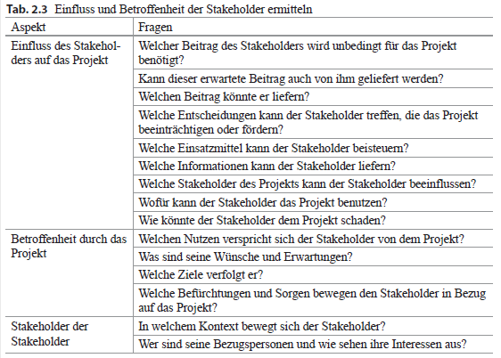
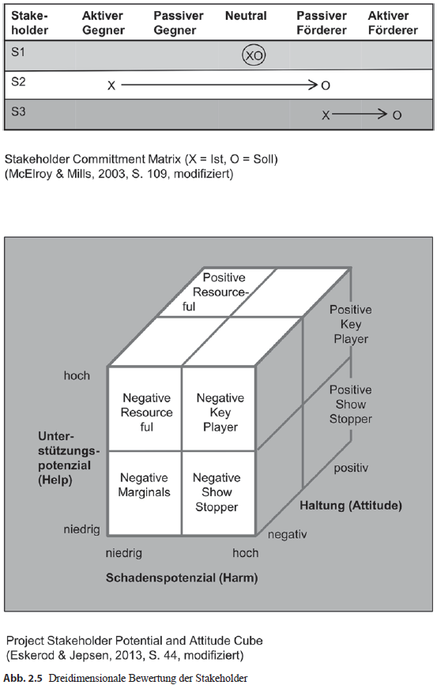
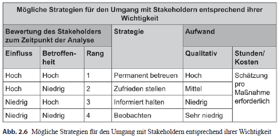
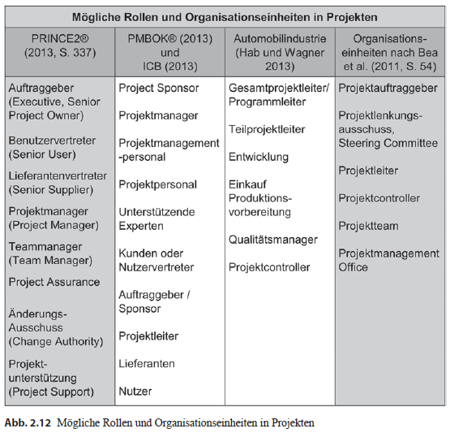
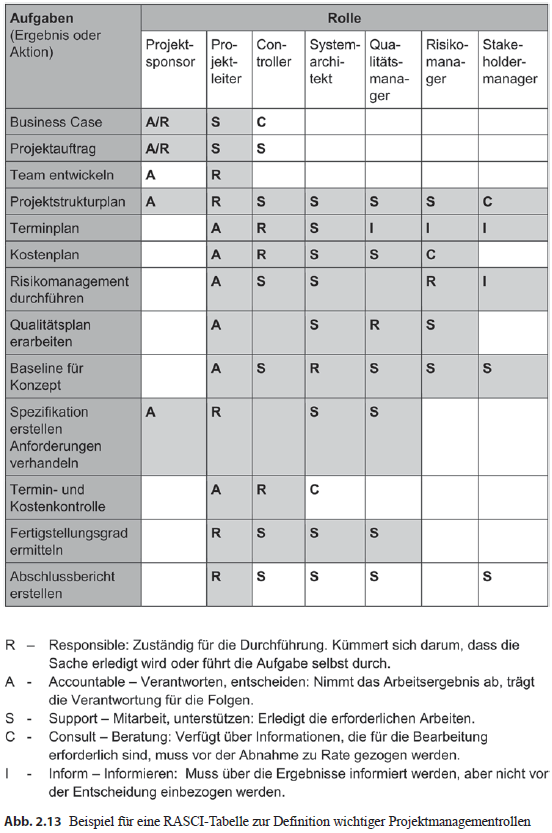

## Projekte definieren 
  
**Zusammenfassung**  
Sobald die Ideen die Köpfe der Mitarbeiter verlassen und Einklang bei der Unternehmensführung  
finden, ist es an der Zeit das Projekt offiziell zu genehmigen und alle dazu notwendigen  
Schritte durchzuführen. Dafür ist es wichtig einen Projektauftrag, auch Charter genannt,  
zu definieren, wo alle wichtigen Aspekte schriftlich festgehalten werden. Dazu zählen  
die detaillierte Beschreibung des Projekts, Festlegung der Termine, grobe Einschätzung  
des Aufwandes. Als nächster Punkt muss das Projektumfeld geklärt werden, indem Teammitglieder  
und die Stakeholder identifiziert, analysiert und angemessen in das Projekt eingebunden werden.  
Rollen und Verantwortlichkeiten müssen geklärt und bestimmt werden, weil die Teammitglieder  
sich einer neuen Aufgabe stellen, für die es bislang keine Verantwortungsbereiche gibt.  
(H. Meyer, H.-J. Reher, Projektmanagement, 2016, S. 41)

### Der Projektauftrag

**Was ist ein Projektauftrag – Project Charter?**
> **Projektauftrag – Project Charter** Die Aufgaben eines Projektauftrages sind, die Arbeiten  
im Projekt zu autorisieren und sicherstelle, dass der Auftraggeber die Projekte steuern kann.  
Die Grundlage der Projektdurchführung sollte klar und deutlich definiert werden, denn das  
sorgt für Reibungsloses arbeiten der Projektbeteiligte.

**Welche Aufgabe hat ein interner Projektauftrag?**
Der interne Projektauftrag hält die wichtigen Eckdaten zum Projekt schriftlich fest und
ist eine Vereinbarung, die zwischen dem internen Auftraggeber und der Projektleitung getroffen
wird. Sie ist Ausgangsbasis für alle weiteren Aktivitäten im Projekt, insbesondere
die Planung und Durchführung des Projekts. Mit dem Projektauftrag erhalten die Projektleitung
und die Teammitglieder die Erlaubnis, an dem Projekt zu arbeiten sowie Material,
Ausstattung, Budget und andere vereinbarte Ressourcen für das Projekt zu verwenden.  
(H. Meyer, H.-J. Reher, Projektmanagement, 2016, S. 43)

> **Interner Auftraggeber – Project Sponsor (Project Owner)** Eine Partei, die an der  
Ausführung von Arbeitsleistungen des Auftragnehmers interessiert ist und dafür finanzielle  
Ressourcen für das Projekt freigibt.

**Wie entsteht der interne Projektauftrag?**
Mit der Gründung eines **Business Cases** entsteht der interne Projektauftrag. 

> **Business Case** Ist die Darstellung und Abwägung der rechenbaren Aspekte einer  
Investition. In einem Business Case werden die Kosten für ein Projekt und die mit seinen  
Ergebnissen erzielten Erträge untersucht.

Der **Business Case** soll folgende Fragen klären:
- Warum ist das Projekt sinnvoll?
- Wie passt das Projekt in die existierende Strategie der Organisation?
- Welche Stakeholder sind betroffen und wie stehen Sie zu der Projektidee?
- Welche alternativen Lösungsideen existieren für den identifizierten Bedarf?
- Wie hoch sind Aufwand und erwarteter Nutzen und stehen sie in einem sinnvollen Verhältnis?  
(Lohnt sich das Projekt?)
- Können wir uns das Projekt leisten, woher kommen die benötigten Ressourcen? (Finanzierbarkeit)
- Verfügen wir über die notwendigen Kompetenzen? (Umsetzbarkeit)
- Welche Risiken und negativen Nebeneffekte sind zu erwarten?

**Ziel der Projektauftragsklärung**  
Wenn ein Projektleiter seine Ziele, Aufgaben und Rahmenbedingungen nicht kennt, kann es unter  
Umständen enorme negative Auswirkungen auf das Projekt haben und darüber hinaus einen erheblichen  
wirtschaftlichen Schaden für das Unternehmen nach sich ziehen.

Deswegen sollen folgende Punkte der Auftragsklärung geklärt werden:
- Warum soll das Projekt durchgeführt werden?
- Wer will was damit erreichen?
- Was soll nach Projektabschluss anders sein?
- Wann soll das Projekt fertig sein?

**Kein Projektstart ohne Projektauftrag!**  
Ein Projektstart umfasst seiner Ansicht nach folgende drei Aspekte:
- die Stakeholder- und Risikoanalyse
- die Projektbeauftragung
- die Projekt-Kick-Off-Veranstaltung und den Start-up-Workshop.

> **Projekt-Start-Workshop – Start-up-Workshop** Der Projekt-Start-Workshop ist die umfangreichste  
Informationsveranstaltung zum Projektstart. In diesem Workshop wird die gesamte Projektplanung,  
unter der Moderation des Projektleiters, gemeinsam mit dem Projektteam erarbeitet. Ziel der  
Veranstaltung ist es mit allen Projektmitgliedern einen gemeinsamen Informationsstand zu  
erlangen und Fragen bezüglich der jeweiligen Rollen im Projekt zu klären

> **Kick-off-Veranstaltung** Das Kick-Off-Meeting ist in der Regel aufwändiger als eine  
Planungsinformationssitzung. Der Projektleiter trifft Meeting-Vorbereitungen, die nur die  
grobe Planung der Projektpläne beinhalten und diskutiert die Details mit dem Projektteam.

**Projektbeteiligte** Die Auftraggeber- und Auftragnehmerorganisation einschließlich der
projektbezogenen Entscheidungsträger in Person und Funktion sollten genannt werden,
wie auch die Projektleitung und erste Teammitglieder. Wichtige Stakeholder, die unbedingt
einzubinden sind, ggf. in einem Lenkungsausschuss als übergeordnetes Entscheidungsgremium,
sollten ebenfalls bestimmt werden. (H. Meyer, H.-J. Reher, Projektmanagement, 2016, S. 45)

Im Laufe der Zeit entwickelt sich ein Muster als Mßstab, für einen einheitlichen, gut  
strukturierten Projektauftrag, bekannt auch als Projektcharter, der sich in der Praxis bewehrte.  
Dieses Muster ermöglicht einem, die Daten auf einer einheitlichen, informativen und lückenlosen  
Form zu dokumentieren. (Siehe Abbl 2.1 und 2.2)  

> **Lenkungsausschuss – Steering Committe/Project Board.** Ist das oberste beschlussfassende  
Gremium eines Projekts. Hauptfunktionen des Lenkungsausschusses sind Projektkontrolle und  
Projektsteuerung. Der Projektleiter berichtet an den Lenkungsausschuss. Außerdem befassen  
sich die Beteiligten mit auftretenden Probleme, z.B. Planabweichungen, in den  
Lenkungsausschuss- und Meilenstein-Sitzungen.

**Grenzen des Projekts** Mit dem Begriff Grenze soll geklärt werden, welche Aufgaben der  
Auftraggeber erledigen muss und welche Voraussetzungen und Rahmenbedingungen vorliegen  
müssen, damit die Projektarbeit beginnen kann und welche Aufgaben nicht der Gegenstand  
der Projektarbeit sind.

**Wann sollte der Projektauftrag verabschiedet werden?**
Der Projektauftrag sollte idealerweise am Ende der Definitionsphase beschlossen werden.  
Das Ergebnis wird eingefroren, kann jedoch bei Bedarf geändert werden, aber nur nachdem  
die Änderungen über einen definierten Prozess freigegeben wurden.

### Stakeholdermanagement

In der Definitionsphase des Projekts müssen Projektumfeld und Kooperationskontext geklärt
werden. Im Zentrum dieser Frage stehen die sozialen Einflussfaktoren, die Stakeholder
des Projekts. (H. Meyer, H.-J. Reher, Projektmanagement, 2016, S. 58)

**Was sind Stakeholder?**  
Stakeholder sind Interessensgruppen/ -personen, die am Projekt direkt oder indirekt teilnehmen.  

**Warum ist Stakeholdermanagement erforderlich?**  
Um die Wahrscheinlichkeit des Projekterfolgs zu erhöhen, müssen alle Interessensgruppen/  
-personen identifiziert, analysiert, kategorisiert werden. Besteht die Notwendigkeit der
Einbindung der Stakeholder, werden Strategien für den jeweilige Stakeholder entwickelt  
und gewisse Maßnahmen eingeleitet.
 
Stakeholder können wichtige Informationsquellen sein:
- für die Definition der Ziele
- für die Anforderungsanalyse
- für die Risikomanagement.

Die Stakeholder werden in fünf Kategorien eingestuft und stehen unter ständiger Überwachung.
- **Förderer**, die sich für das Projekt engagieren. Sie sind Befürworter des Projekts und
leisten einen wichtigen Beitrag zum Projekt, indem sie Ressourcen liefern und dabei
helfen, Anforderungen zu definieren.
- **Skeptiker**, oft schwer durchschaubar, die sachlich gegen das Projekt argumentieren.
Sie können aber wichtige Hinweise zum Risikomanagement beitragen.
- **Opponenten**, d. h. Projektgegner, aber auch **Gleichgültige**, die, wenn möglich, zur
aktiven Mitarbeit bewegt werden müssen, da sie über wichtige Informationen und Einflussmöglichkeiten
verfügen.
- Tendenziell **neutral** eingestellte Stakeholder, die weiter beobachtet werden müssen,
weil sie ihre Position zum Projekt verändern können.

**Wie kann Stakeholdermanagement in Projekten umgesetzt werden?**
Das Stakeholdermanagement soll schon sehr **früh** Großteil der Arbeit im Projekt erledigen.  
Die Stakeholder sollen dazu bewegt werden eine positive, zumindest keine ablehnende Haltung gegenüber  
dem Projekt einzunehmen. Deswegen ist es wichtig für jeden Stakeholder folgende Punkte zu durchgehen:
- Wahrnehmen und nicht ignorieren.
- Verstehen, d. h. versuchen, in die Rolle des anderen zu schlüpfen.
- Unterstützen, das bedeutet Kontakt aufnehmen und Feedback geben.
- Einbeziehen, d. h. in den Projektablauf integrieren.
- Zu einer positiven Verpflichtung (Commitment) gegenüber dem Projekt bewegen.

**Wie können die Stakeholder identifiziert werden?**  
Die Stakeholder können aufgrund der früheren Erfahrungswerte der Projektbeteiligten, sowie Gespräche  
mit dem Auftraggeber, identifiziert werden. Am Besten hilft dabei die Tabelle 2.3 bei der  
Ermittlung des Einflusses und der Betroffenheit der Stakeholder.

**Stakeholderregister** ist ein wichtiges Werkzeug/Dokument, welches alle Informationen über den  
Stakeholder beinhaltet, wie:
- Daten über den jeweiligen Stakeholder
- Klassifikation
- notwendige Strategien, ggf. Maßnahmen  

**Werkzeuge zur Bewertung der Stakeholder**  
Im Laufe der Zeit haben sich zwei Werkzeuge als hilfreich erwiesen, für die Bewertung und Analyse der  
Stakeholder. Ein **zweidimensionales Portfolio**, es beschreibt die Macht und das Interesse  
bzw. die Betroffenheit eines Stakeholder bezogen auf das Projekt. In einer **dreidimensionalen  
Portfolio** wird analysiert, wie stark ist das Potenzial, das Projekt zu unterstützen  
oder ihm zu schaden. (Siehe Abb. 2.5)  
Nach der Analyse stellt sich die Frage:
- Im positiven Sinne, über welche Möglichkeiten verfügt der Stakeholder, um das Projekt zu stärken.
- Im negativen Sinne, welche Möglichekeiten hat der Stakeholder, dem Projekt zu schaden.  

**Welche Strategien sollen gewählt werden?**  
Nach der Bewertung und Analyse der Stakeholder, stehen uns die Informationen zur Verfügung, welche  
Stakeholder von großer Bedeutung sind und welche nicht. Das spiegelt sich in der Aufwands-, Kosten- und  
Zeitgründen wieder. (Siehe Abb. 2.6) **Stakeholderstrategien** beschreibt die Intensität und die Dauer  
des Verhaltens, welches gegenüber dem Stakeholder betrieben werden soll.

  

### Rollen im Projektmanagement

In jedem Projekt werden vielfältige Rollen von den Projektmitarbeitern ausgefüllt. Einige der wichtigen Rollen,  
und Organisationseinheiten können sie der Abb 2.12 entnehmen.

#### Rolle klären

> **Rolle – Role** Eine Rolle ist eine personenunabhängige Bündelung von Aufgaben, Kompetenzen und Verantwortung.  
Jede Rolle erfordert bestimmte Fähigkeiten und Kenntnisse und ist mit bestimmten Kompetenzen ausgestattet.

**Weshalb ist es sinnvoll, Rollen zu definieren?**  
Rollen ist ein wichtiges Werkzeug in einem Projekt. Im Projekt müssen viele Aufgaben, arbeitsteilige Prozesse erfüllt  
werden, um den Gesamtumfang des Projektes zu erreichen. Welche Rollen von welchen Personen eingenommen werden,  
wird im Rahmen der Definitionsphase eines Projektes geklärt.

**Welche Rollen sind wichtig in einem Projekt**  
Da Projekte sehr vielschichtig sind, müssen auch verschiedenste Aspekte betrachtet werden. Im Laufe der Zeit haben  
sich gewissen Rollen etabliert, die nicht mehr wegzudenken sind. Dazu gehören:
1. Projektleiter – Project Manager
2. Projektcontroller – Project Controller
3. Systemarchitekt – Systems Engineer (Systems Architect), auch Systemverantwortlicher
4. Qualitätsmanager – Quality Manager
5. Risikomanager – Risk Manager
6. Stakeholdermanager – Stakeholder Manager.  

Die Rollen stellen sicher, dass
- die notwendigen Aufgaben erfüllt werden
- die Termine eingehalten werden
- die geforderten Lieferleistungen erfüllt werden
- die Qualität der Lieferleistungen dem gewünschten Ziel entsprechen

**Projektleiter** nimmt eine eigene Projektrolle ein. Der Projektleiter ist dafür verantwortlich, das Projekt so zu steuern,  
dass es erfolgreich abgeschlossen wird und die Projektziele erreicht werden. In kleineren Projekten nimmt insbesondere der  
Projektleiter mehrere Rollen ein. Je größer das Projekt, desto stärker werden die Projektrollen auf unterschiedliche  
Personen verteilt. Der Projektleiter muss dafür sorgen, dass alle Rollen besetzt sind und definieren, welche  
Verantwortungsbereiche unter die jeweilige Rolle fallen.

**Projektcontroller** Diese Rolle ist für die Überwachung und Steuerung des Projektfortschrittes zuständig.  
Teilweise gehört auch die Überwachung der Kosten zu den Hauptaufgaben.

**Systemarchitekt** Er entwirft auf Basis der Gesamtsystemspezifikation die Systemarchitektur und Unterstützungs-Systemarchitektur.

**Qualitätsmanager** Ist dafür verantwortlich, die Erreichung der Qualitätsziele zu überwachen.

**Stakeholdermanager** Ist dafür verantwortlich, die Stakeholder zu identifizieren, analysieren, geforderte Strategien zu  
entwickeln und stetig in Beobachtung zu halten, um die Wahrscheinlichkeit der Erfolgsrate beim Projekt zu erhöhen.

#### Was ist eine RASCI-Chart und wie kann es bei der Klärung der Rollen helfen 
Mit RASCI wird eine Technik zur Analyse und Darstellung von Verantwortlichkeiten bezeichnet. Es handelt sich um eine Matrix,  
aus der hervorgeht, welche Beteiligten wofür verantwortlich sind.

Dabei werden folgende Fragen beantwortet:
- Welche Aufgaben sind zu erledigen?
- Welche Rollen sind beteiligt?
- Wer ist wofür verantwortlich?

Ein mögliches Beispiel für die Rollenklärung mit dem RASCI-Chart zeigt Abb. 2.13

#### Wer ist beteiligt bei der Rollenklärung und wann ist dies am besten zu tun
Die Rollenklärung muss sehr früh im Projekt passieren. Am besten eignet sich der Projekt-Start-Workshop dazu.  
Im Laufe des Projektes, können gewissen Veränderungen der Rollen passieren. Deswegen ist es wichtig,  
beim Beginn einer neuen Phase die Aktualität der Rollen zu besprechen.
