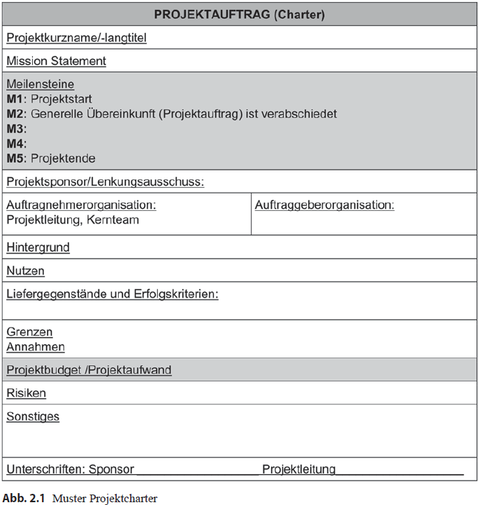
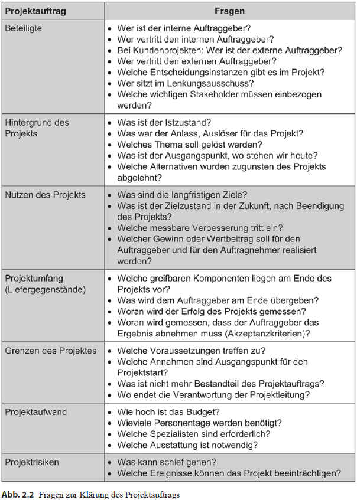

## Projekte definieren 
  
**Zusammenfassung**  
Sobald die Ideen die Köpfe der Mitarbeiter verlassen und Einklang bei der Unternehmensführung  
finden, ist es an der Zeit das Projekt offiziell zu genehmigen und alle dazu notwendigen  
Schritte durchzuführen. Dafür ist es wichtig einen Projektauftrag, auch Charter genannt,  
zu definieren, wo alle wichtigen Aspekte schriftlich festgehalten werden. Dazu zählen  
die detaillierte Beschreibung des Projekts, Festlegung der Termine, grobe Einschätzung  
des Aufwandes. Als nächster Punkt muss das Projektumfeld geklärt werden, indem Teammitglieder  
und die Stakeholder identifiziert, analysiert und angemessen in das Projekt eingebunden werden.  
Rollen und Verantwortlichkeiten müssen geklärt und bestimmt werden, weil die Teammitglieder  
sich einer neuen Aufgabe stellen, für die es bislang keine Verantwortungsbereiche gibt.

### Der Projektauftrag

**Was ist ein Projektauftrag – Project Charter?**
> **Projektauftrag – Project Charter** „Ein Dokument, das vom Initiator oder Sponsor des
Projekts herausgegeben wird, der die Existenz eines Projekts formell genehmigt, und das
den Projektmanager berechtigt, Ressourcen der Organisation für Projektvorgänge einzusetzen“
(PMI 2013b, S. 549).

**Welche Aufgabe hat ein interner Projektauftrag?**
Der interne Projektauftrag hält die wichtigen Eckdaten zum Projekt schriftlich fest und
ist eine Vereinbarung, die zwischen dem internen Auftraggeber und der Projektleitung getroffen
wird. Sie ist Ausgangsbasis für alle weiteren Aktivitäten im Projekt, insbesondere
die Planung und Durchführung des Projekts. Mit dem Projektauftrag erhalten die Projektleitung
und die Teammitglieder die Erlaubnis, an dem Projekt zu arbeiten sowie Material,
Ausstattung, Budget und andere vereinbarte Ressourcen für das Projekt zu verwenden.  
(H. Meyer, H.-J. Reher, Projektmanagement, 2016, S. 43)

> **Interner Auftraggeber – Project Sponsor (Project Owner)** Eine Partei, die an der  
Ausführung von Arbeitsleistungen des Auftragnehmers interessiert ist und dafür finanzielle  
Ressourcen für das Projekt freigibt.

**Wie entsteht der interne Projektauftrag?**
Ausgangspunkt für den internen Projektauftrag ist die Projektbegründung, auch Business
Case genannt. (H. Meyer, H.-J. Reher, Projektmanagement, 2016, S. 43)

> **Business Case** Ist die Darstellung und Abwägung der rechenbaren Aspekte einer  
Investition. In einem Business Case werden die Kosten für ein Projekt und die mit seinen  
Ergebnissen erzielten Erträge untersucht.

Der **Business Case** soll folgende Fragen klären:
- Warum ist das Projekt sinnvoll?
- Wie passt das Projekt in die existierende Strategie der Organisation?
- Welche Stakeholder sind betroffen und wie stehen Sie zu der Projektidee?
- Welche alternativen Lösungsideen existieren für den identifizierten Bedarf?
- Wie hoch sind Aufwand und erwarteter Nutzen und stehen sie in einem sinnvollen Verhältnis?  
(Lohnt sich das Projekt?)
- Können wir uns das Projekt leisten, woher kommen die benötigten Ressourcen? (Finanzierbarkeit)
- Verfügen wir über die notwendigen Kompetenzen? (Umsetzbarkeit)
- Welche Risiken und negativen Nebeneffekte sind zu erwarten?

**Ziel der Projektauftragsklärung**  
Wenn ein Projektleiter seine Ziele, Aufgaben und Rahmenbedingungen nicht kennt, kann es unter  
Umständen enorme negative Auswirkungen auf das Projekt haben und darüber hinaus einen erheblichen  
wirtschaftlichen Schaden für das Unternehmen nach sich ziehen.

Deswegen sollen folgende Punkte der Auftragsklärung geklärt werden:
- Warum soll das Projekt durchgeführt werden?
- Wer will was damit erreichen?
- Was soll nach Projektabschluss anders sein?
- Wann soll das Projekt fertig sein?

**Kein Projektstart ohne Projektauftrag!**  
Ein Projektstart umfasst seiner Ansicht nach folgende drei Aspekte:
- die Stakeholder- und Risikoanalyse
- die Projektbeauftragung
- die Projekt-Kick-Off-Veranstaltung und den Start-up-Workshop.

> **Projekt-Start-Workshop – Start-up-Workshop** Der Projekt-Start-Workshop ist die umfangreichste  
Informationsveranstaltung zum Projektstart. In diesem Workshop wird die gesamte Projektplanung,  
unter der Moderation des Projektleiters, gemeinsam mit dem Projektteam erarbeitet. Ziel der  
Veranstaltung ist es mit allen Projektmitgliedern einen gemeinsamen Informationsstand zu  
erlangen und Fragen bezüglich der jeweiligen Rollen im Projekt zu klären

> **Kick-off-Veranstaltung** Das Kick-Off-Meeting ist in der Regel aufwändiger als eine  
Planungsinformationssitzung. Der Projektleiter trifft Meeting-Vorbereitungen, die nur die  
grobe Planung der Projektpläne beinhalten und diskutiert die Details mit dem Projektteam.

**Projektbeteiligte** Die Auftraggeber- und Auftragnehmerorganisation einschließlich der
projektbezogenen Entscheidungsträger in Person und Funktion sollten genannt werden,
wie auch die Projektleitung und erste Teammitglieder. Wichtige Stakeholder, die unbedingt
einzubinden sind, ggf. in einem Lenkungsausschuss als übergeordnetes Entscheidungsgremium,
sollten ebenfalls bestimmt werden. (H. Meyer, H.-J. Reher, Projektmanagement, 2016, S. 45)

In den vergangenen Jahren entwickelten die Autoren ein Muster für einen Projektauftrag
(Projektcharter), das sich in der praktischen Anwendung bewährte. Im Sinne einer
generellen Übereinkunft erleichtert diese Form, die auf das Wesentliche konzentrierten
Informationen strukturiert zu dokumentieren (vgl. Abb. 2.1 und 2.2).  
(H. Meyer, H.-J. Reher, Projektmanagement, 2016, S. 45)

> **Lenkungsausschuss – Steering Committe/Project Board.** Ist das oberste beschlussfassende  
Gremium eines Projekts. Hauptfunktionen des Lenkungsausschusses sind Projektkontrolle und  
Projektsteuerung. Der Projektleiter berichtet an den Lenkungsausschuss. Außerdem befassen  
sich die Beteiligten mit auftretenden Probleme, z.B. Planabweichungen, in den  
Lenkungsausschuss- und Meilenstein-Sitzungen.

**Wann sollte der Projektauftrag verabschiedet werden?**
Der Projektauftrag sollte idealerweise am Ende der Definitionsphase beschlossen werden.  
Das Ergebnis wird eingefroren, kann jedoch bei Bedarf geändert werden, aber nur nachdem  
die Änderungen über einen definierten Prozess freigegeben wurden.

**Grenzen des Projekts** Mit dem Begriff Grenze soll geklärt werden, welche Aufgaben der  
Auftraggeber erledigen muss und welche Voraussetzungen und Rahmenbedingungen vorliegen  
müssen, damit die Projektarbeit beginnen kann und welche Aufgaben nicht der Gegenstand  
der Projektarbeit sind.

### Stakeholdermanagement

In der Definitionsphase des Projekts müssen Projektumfeld und Kooperationskontext geklärt
werden. Im Zentrum dieser Frage stehen die sozialen Einflussfaktoren, die Stakeholder
des Projekts.

**Was ist Stakeholdermanagement?**  
Stakeholdermanagement befasst sich mit den am Projekt interessierten Personen. Wer sind  
mögliche Unterstützer, Betroffene, Interessierte oder mögliche Gegner? Was bewegt sie,  
wie sollen sie eingebunden werden? Diese und andere Fragen gilt es zu lösen. Wer hat  
nicht schon von aufgebrachten Anwohnern, frustrierten Mitarbeitern, kooperationsunwilligen 
Linienvorgesetzen oder schwierigen Kunden in Zusammenhang mit Projekten gehört? Je nach Projekt
wird das Management der Stakeholder verschiedene Dimensionen einnehmen. Fest steht
jedoch, dass es für den Erfolg des Projekts wichtig ist, sich dieser Aufgabe bereits in frühen
Projektphasen zu widmen. (H. Meyer, H.-J. Reher, Projektmanagement, 2016, S. 58)

> **Stakeholder – Projektbeteiligte, Interessierte Parteien** Gesamtheit alle Projektteilnehmer, 
-betroffenen und -interessierten, deren Interessen durch den Verlauf oder das Ergebnis des  
Projekts direkt oder indirekt berührt sind.

> **Stakeholdermanagement**  Stakeholdermanagement hat die Aufgabe die Stakeholder zu identifizieren, 
analysieren und Entwicklung der Strategien und deren Umsetzung.

**Warum ist Stakeholdermanagement erforderlich?**  
Durch das Einbeziehen der Stakeholder soll die Wahrscheinlichkeit des Projekterfolgs erhöht werden.  
Deshalb kann es sinnvoll sein, die Projekterfolgskriterien gemeinsam mit den Stakeholdern  
zu definieren. Die Schwierigkeit besteht darin, zu entscheiden, welche Stakeholder wie  
berücksichtigt und eingebunden werden.  
Stakeholder liefern wichtige Informationen:
- für die Definition der Ziele
- für die Anforderungsanalyse
- für die Risikomanagement.

Die fünf Kategorisierungsstufen der Stakeholder:
- **Förderer**, die sich für das Projekt engagieren. Sie sind Befürworter des Projekts und
leisten einen wichtigen Beitrag zum Projekt, indem sie Ressourcen liefern und dabei
helfen, Anforderungen zu definieren.
- **Skeptiker**, oft schwer durchschaubar, die sachlich gegen das Projekt argumentieren.
Sie können aber wichtige Hinweise zum Risikomanagement beitragen.
- **Opponenten**, d. h. Projektgegner, aber auch **Gleichgültige**, die, wenn möglich, zur
aktiven Mitarbeit bewegt werden müssen, da sie über wichtige Informationen und Einflussmöglichkeiten
verfügen.
- Tendenziell **neutral** eingestellte Stakeholder, die weiter beobachtet werden müssen,
weil sie ihre Position zum Projekt verändern können.

**Wie kann Stakeholdermanagement in Projekten umgesetzt werden?**
Das Stakeholdermanagement soll schon sehr **früh** Großteil der Arbeit im Projekt erledigen.  
Die Stakeholder sollen dazu bewegt werden eine positive, zumindest keine ablehnende Haltung gegenüber  
dem Projekt einzunehmen. Deswegen ist es wichtig für jeden Stakeholder folgende Punkte zu durchgehen:
- Wahrnehmen und nicht ignorieren.
- Verstehen, d. h. versuchen, in die Rolle des anderen zu schlüpfen.
- Unterstützen, das bedeutet Kontakt aufnehmen und Feedback geben.
- Einbeziehen, d. h. in den Projektablauf integrieren.
- Zu einer positiven Verpflichtung (Commitment) gegenüber dem Projekt bewegen.

Stakeholdermanagement umfasst grundsätzlich die Schritte Planen, Umsetzen, Kontrollieren
und Anpassen. Bezogen auf die Stakeholder bedeutet dies:
− Stakeholderanalyse
  − Stakeholder, identifizieren, d. h. wahrnehmen und verstehen.
  − Stakeholder bewerten.
− Strategien und Maßnahmen entwickeln, auswählen und umsetzen.
− Beobachten, in Kontakt bleiben und Stakeholdermanagement verstetigen und anpassen.

**Wie können die Stakeholder identifiziert werden?**
Nicht das Projektteam entscheidet wer Stakeholder ist, sondern jeder, der sich für einen
Stakeholder des Projekts hält, ist ein Stakeholder. (H. Meyer, H.-J. Reher, Projektmanagement, 2016, S. 61)

>  **Stakeholderregister** Das Stakeholderregister ist „ein Projektdokument, das die Identifikation,  
Einschätzung und Klassifikation der Stakeholder eines Projekts beinhaltet. 

**Stakeholderstrategien** beschreiben das Verhalten, welches gegenüber dem Stakeholder kurz- oder  
langfristig eingesetzt werden sollen.

### Rollen im Projektmanagement

In der Projektpraxis existieren unterschiedliche Rollen und Organisationseinheiten wie
auch verschiedene Bezeichnungen (vgl. hierzu Abb. 2.12).

#### Rolle klären

> **Rolle – Role** „Eine Rolle beinhaltet die Summe der Erwartungen des Umfelds an den
Inhaber einer bestimmten Stelle. Rollen sind grundsätzlich personenunabhängig“ (Bea
et al. 2011, S. 54).

### Das Team

## Quellen
#### Quelle1 aus Buch A Seite B von Zeile C bis D 
