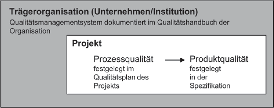
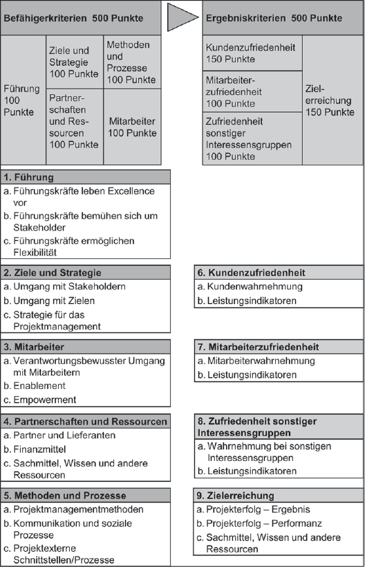
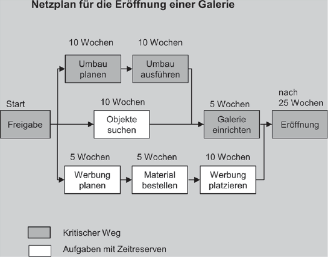
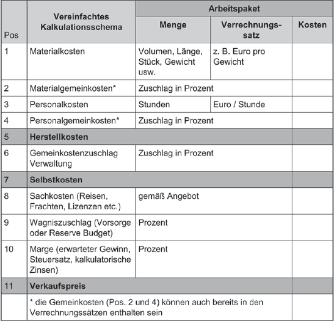

### Qualität planen

Die Qualität eines Produktes ist äußerst wichtig und bietet eine Vielzahl an Vorteile, wie zum Beispiel:
- das Gewinnen des Vertrauens des Kunden
- das effizientere Arbeiten
- das Weiterbilden der Beteiligten
- das Abheben von der Konkurrenz in wettbewerbsstarken Branchen

und viele mehr.  
Qualität zu erzeugen ist jedoch kompliziert und umfasst mehr als nur 'wie gut läuft das Endprodukt.'

#### Arten von Qualität

Es gibt zwei Arten von Qualitäten, die man versucht in einem Projekt zu erzeugen:
- Produktqualität: Ein Produkt ist von hoher Qualität, wenn der Kunde genau das ausgemachte Produkt gemäß aller zuvor festgelegten Anforderungen von dem Projektteam ausgeliefert bekommt
- Prozessqualität: Ein Prozess ist von hoher Qualität, wenn alle gesetzten Qualitätsziele über das gesamte Projekt hinweg eingehalten werden bzw. erfüllt sind

Die Produktqualität wird also im Verlauf des Projekts aufgebaut, angefangen mit der Planung des Projekts.

#### Qualität - Wie?
Das Qualitätsmanagement jedes Projektes übernimmt entweder der Qualitätsbeauftragte oder das Qualitätshandbuch.  
Jedes Unternehmen, das schon Erfahrung mit Projekten hat, wird ein Qualitätshandbuch haben, in welchem alle Qualitätsziele definiert sind. Ist es jedoch das oder eines der ersten Projekte eines Unternehmens kann es auch sein, dass noch kein Qualitätshandbuch vorhanden ist. In dem Fall muss ein Qualitätsbeauftragter festgelegt werden, der die Qualitätsziele definiert.
Durch die Qualitätsziele wird eindeutig:
- Wie soll im Porjekt gearbeitet werden?
- Welche Prioritäten werden gesetzt?
- An welchen Kriterien wird Qualität gemessen?

Die gewählten und definiterten Qualitätsziele werden dann zusammen in einen Qualitätsplan geschrieben, der über das gesamte Projekt Geltung hat.  
Erfahrungen aus vergangenen Projekten können Faktoren sein, die einfluss auf das aktuelle Qualitätsmanagement haben, bis ein Unternehmen alle gesammelten Erfahrungen in dem Qualitätshandbuch zusammenträgt.

#### Bewertung von Qualität
Die Qualität des Projektes wird nicht nur zum Ende des Projekts bewertet, sondern im besten Fall auch zu den einzelnen Meilensteinen. Dazu wird das Produkt anhand der festgelegten Verifikations- und Validierungsmethoden, und der Prozess anhand der Erfolgskriterien und Qualitätsziele bewertet.  
In kleineren Projekten ist es oft ausreichend, wenn die einzelnen Teammitglieder sich absprechen, woran sie die Qualität messen wollen, für größere Projekte werden Modelle verwendet, wie zum Beispiel das *Project Excellence Modell*.

**Project Excellence Modell**  
Das Project Excellence Model bietet Kriterien, anhand derer man die Projektleistungen bewertet und mit den Leistungen anderer Projekte vergleichen kann. Das Auszeichnen großartiger Projektleistungen sowie die Möglichkeit zur Selbstbewertung des Projekts wird den Projektleitern geboten.  
Neben der objektiven Bewertung, ob die Ziele erreicht wurden, werden auch die subjektiven Eindrücke der verschiedenen Stakeholder mit einbezogen.

### Projektablauf und Termine planen

In jedem Projekt muss zu Beginn der Ablauf geplant werden, das heißt, dass sich Gedanken darüber gemacht wird, was in welcher Reihenfolge erledigt werden muss. Dabei muss aber zwischen mehreren Arten von Terminplänen unterschieden werden:
- Meilensteinplan, auch genannt Vertragsterminplan
- Masterteminplan
- Terminpläne für externe und interne Lieferanten

#### Der Meilensteinplan
Der Meilensteinplan wird in Kooperation mit dem Kunden aufgestellt und umfasst die wichtigsten Meilensteine aus der Sicht des Kunden. Diese Meilensteine sind generell:
- Kick-off-Veranstaltung
- Wichtige Projektphasen wie Entwicklung oder Durchführung
- Termine für Reviews und Übergabe der Liefergegenstände
- Ende des Projekts

Desweiteren kann der Meilensteinplan wichtige kundenbezogene, technische oder finanzielle Meilensteine enthalten, z.B. wann der Kunde wie viel Prozent des Gesamtpreises bezahlt oder Termine für Überprüfungen, angestrebte Genehmigungen, Probeläufe, Abnahme und Übergabe.  
Ist der Meilensteinplan erst einmal vereinbart, ist eine Änderung nur unter Bestätigung des Kunden möglich.

#### Der Masterterminplan

Der Masterterminplan wird schrittweise im Projektteam erarbeitet und ist auch nur für das interne Projektteam zugänglich. Er enthält alle wichtigen:
- Teilaufgaben
- Phasen
- Arbeitspakete
- Meilensteine

Dargestellt werden kann der Masterterminplan sowohl bis ins Detail der einzelnen Abschnitte als auch komprimiert für die Übersicht, und er dient dem Soll-Ist-Vergleich.  
Es werden Auslösezeitpunkte für beispielsweise Lieferanten, sowie Zeitpuffer, unter der Berücksichtigung der Risiken und des Schwierigkeitsgrades einzelner Meilensteine, festgehalten.  
Bei den Zeitabschätzungen von z.B. den Arbeitspaketen müssen auch mehr Aspekte als der reine Arbeitsaufwand berücksichtigt werden. Teilt man einer Aufgabe fünf Arbeitskräften zu erledigen sie die Aufgabe nicht fünf-mal schneller. Zu einer größeren Gruppenzahl kommt auch immer ein größerer Kommunikationsaufwand, und die Qualifikationen jedes einzelnen Teammitglieds sind auch zu beachten.  
Der Masterteminplan ist nicht auf den ersten Versuch perfekt, weshalb er in mehreren Iterationen angepasst und verbessert wird. Das gesamte Projektteam ist an der Erarbeitung beteiligt und stimmt über alle Änderungen ab.

#### Terminpläne für externe und interne Lieferanten

Diese Pläne sind sehr variable je nachdem, an wen die Pläne gerichtet sind. Sie enthalten Informationen, die für den jeweiligen Teilhaber von Bedeutung sind, z.B. wann gewisse Teile geliefert, oder wann eine bestimmte Aufgabe erledigt sein muss.  
Termine aus den Terminplänen für externe und interne Lieferanten bestehen stets ohne die Pufferzeiten, die im Masterterminplan vereinbart wurden. Im Falle von externen Lieferanten werden Aufgaben und Termine durch Verträge und Bestellungen, im Falle von internen Lieferanten in den Arbeitsaufträgen festgehalten, und gegebenfalls aus den Arbeitspaketbeschreibungen abgeleitet.

#### "Warum Termintreue?"

Termintreue ist ein Qualitätsmerkmal. Es steigert die Zusammenarbeit aller Beteiligten des Projekts und hat immer hohe, oft sogar die höchste Priorität in Projekten. Sie stärkt das Vertrauen aller im Innen- sowie Außenverhältnis und das Nichteinhalten von Terminen kann zu dem genauen Gegenteil der positiven Aspekte, sowie starken Imageschäden führen.

#### Festlegung der Termine

Die Hauptaufgabe der Planung der konkreten Termine hat der Projektcontroller. Dieser legt die den Meilensteinplan zusammen mit dem Kunden bzw. dem Projektcharter fest. Der Masterterminplan wird anschließend zusammen mit allen Beteiligten des Projektteams schrittweise erstellt.  
Der Projektcontroller ist auch für die Pflege der jeweiligen Terminpläne zuständig - sollten sich Änderungen ergeben. Zur Aufstellung aller Pläne bedient sich der Projektcontroller Modellen wie der Terminliste, den Balkenplänen (auch genannt Gantt-Diagramme) oder der Netzplantechnik.

**Terminliste**  
Die Terminliste ist das einfachste der drei hier vorgestellten Modelle. Es eignet sich gut für kleinere Projekte, die generell etwas weniger komplexe Planung haben. Hier werden die Aufgaben in der logisch auftretenden Reihenfolge in einer Tabelle dargestellt und zusammen mit den geschätzen Dauern Terminen zugeordnet.

**Balkenpläne**  
Die Balkenpläne sind das Mittelmaß der Terminplanung: Sie sind einfach zu erstellen, leicht überschaubar und eignen sich auch für größere Projekte relativ gut. Die Aufgaben werden hier als Balken auf einer Zeitachse dargestellt, wobei sie auch auch untereinander stehen können, wodurch gewisse Überlappungen der Aufgaben möglich sind. Meilensteine werden in Form eines festgelegten Symbols an die entsprechenden Stellen der Balken gezeichnet.  
Balkenpläne haben jedoch den Nachteil, dass Abhängigkeiten leicht übersehen werden, welcher aber durch die Vernetzung der logischen Abhängigkeiten mit Hilfe von Pfeilen behoben werden kann.

**Netzplantechnik**  
Die Netzplantechnik, auch wenn der Name eigentlich nur ein Oberbegriff für vielerlei Methoden ist, ist für komplexe Projekte mit vielerlei Abhängigkeiten geeignet. Mit Hilfe von einem Netz bestehend aus Knoten und Kanten und einem sogenannten **kritischen Weg** lässt sich leicht die mindest erforderliche Laufzeit eines Projektes modellieren. Jegliche Pfade deren Verzögerung den vereinbarten Termin des Projektendes nicht nach hinten verschieben, sofern sie nicht übermäßig verzögern, heißen nichtkritische Vorgänge. Sie sind nicht ausschlaggebend für das Bestehen des Projekts, weshalb sie meistens **KANN**-Vorschläge des Kundens sind.  
Auch wenn die Netzplantechnik die Möglichkeit bietet, praktisch jeden Ablauf zu modellieren, eignet sie sich nicht für kleinere Projekte, da der Planungsaufwand gegenüber der anderen zwei Methoden erheblich höher ist. Das spontane Ändern der Terminpläne wird somit auch zu einem großen Änderungsaufwand, was in der Praxis dazu führen kann, dass Pläne entstehen, die nicht aktuell sind. Das sollte mit allen Mitteln verhindert werden!

### Aufwand schätzen und Kosten kalkulieren

Damit ein zu erarbeitendes Projekt funktionieren kann, muss die Arbeit entlohnt werden. Zuverlässigkeit und Präzision darf dabei nicht fehlen, weswegen gute Schätzungen des Aufwands und der Kosten wichtig sind.  
Die Kosten eines Projekts haben auch Einfluss auf die anderen Bereiche des Projekts: Die Leistung und die Zeit. Möchte man sich Kosten sparen wird die Qualität des gesamten Projekts, sowie die Zeiteinplanung darunter leiden.  
Die Aufwandsschätzung und Kostenplanung erfüllt mehrere Zwecke:
- Die Kalkulation von "Projektpreisen" bei Auftragsprojekten für externe Kunden
- Die Sicherstellung der Projekteffizienz
- Das Life Cycle Costing
- Die Sicherstellung der Projekteffektivität

**Kalkulation von "Projektpreisen"**  
Der Projektpreis ist um Grunde der Preis, den es kostet, das gesamte Projekt von Start bis zur Überlieferung des Endproduktes zu finanzieren. Dieser Preis wird zu Beginn des Projekts zusammen mit dem Auftraggeber ausgehandelt.  
Aufgrund des großen Wettbewerbs in der Wirtschaft wird meistens eine Preisuntergrenze für Projekte erzwungen: Weniger als dieser Wert geht nicht, sonst würde sich das Projekt nicht für den Auftragnehmer lohnen. Das impliziert allerdings, dass die Entwicklung risikoanfälliger wird, da bei einer Preisuntergrenze, also dem *Mindestwert* des Projekts, kaum oder gar keine Risikozuschläge gewährleistet werden. Läuft alles wie geplant, wird das natürlich keine Probleme machen, jedoch kann auch ein gewisses Maß an Risiko geplant sein, um auf der sicheren Seite zu sein. Da heutzutage die Kunden oftmals die Offenlegung der Kalkulationen erwartet, werden frühzeitig geplante Risikozuschläge oftmals aus der Berechnung herausgenommen.  

**Projekteffizienz**  
Bleibt das Projekt innerhalb der erwarteten Kosten, so ist die Effizienz des Projekts hoch. Werden Ziele hinausgezögert, weil zum Beispiel Soll-Ist- und Soll-Wird-Vergleiche Mängel aufweisen, was unvermeidbar zu einer Erhöhung der Kosten führt, so leidet die Projekteffizienz.  
Regelmäßige Soll-Ist- und Soll-Wird-Vergleiche sollten deshalb durchgeführt werden, um so früh wie möglich Schwachstellen zu finden und sich um sie zu kümmern, bevor sich der Weg verbaut wird.   

**Life Cycle Costing**  
Als Life Cycle Costing bezeichnet man alle Ausgaben, die während des Lebenszykluses eines Produkts anfallen. Angefangen auch hier bei der Entwicklung des Produkts, über die Fertigstellung bis hin zur Produktion bzw. Wartung eines Produktes. Dieser Wert wird schon während der Planungsphase festgelegt, und es ist zwingend notwendig, dass auch die langfristige Wirkung des Projekts aus Sicht des Kunden berücksichtigt wird.

**Projekteffektivität**  
Die Projekteffektivität misst sich anhand des Wertes, das das Produkt für den Auftraggeber erbringt. Dazu wird eine ökonomische Beurteilung aller wirtschaftlichen Folgen herangezogen. Der Kunde hat meistens schon im Voraus eine gewisse Vorstellung davon, was ein Projekt kostet und wie viel das Produkt am Ende einbringt. Hierbei achtet der Kunde auch darauf, wie hoch die Wartungskosten. Je nachdem, wie groß die Unterschiede zwischen Kosten und Gewinn für den Kunden sind, werden dann manche Projekte anderen vorgezogen.  

#### Zusammenführung

Insgesamt ist es sehr kompliziert, alle Zwecke der Aufwandsschätzung korrekt mit einzubeziehen. Dafür gibt es eine umfangreiche Sammlung an Methoden, die sich der "integrierten Projektkostenplanung" witmen.

#### Schätzungen aufstellen

Schätzungen werden aufgestellt, indem für bestimmte Aufgaben ein bestimmter Zeitrahmen festgelegt und mit Geld bewertet wird. Präzise Schätzungen aufzustellen ist jedoch schwer, da, per Definition eines Projekts, oft neuartige Aufgaben zu bearbeiten sind. Um eine möglichst genaue Schätzung zu erhalten, betrachtet man folgende Einflüsse:
- Definition der Liefergegenstände
- Stakeholder- und Risikomanagement
- Requirements Engineering

Auf diese Themen wird in anderen Abschnitten eingegangen.  
Die eigentlichen Schätzungen finden in drei Schritten statt:
- Top-down grobe Schätzung der Kosten
- Bottom-up Ermittlung der Kosten basierend auf den Arbeitspaketen
- Zusammenführung der beiden Schätzungen, überführen in einen akzeptierten Kostenplan

**Top-down Schätzung**  
Die Top-down Schätzung findet oft in den frühren Projektphasen statt, was jedoch nicht immer vom Vorteil ist. Je früher die Schätzung im Projekt stattfindet, desto ungenauer wird sie sein. Spricht man von Begriffen wie "Kostenrahmen", "Kostenüberschlag" oder "Rough Order of Magnitude" wird davon ausgegangen, dass noch große Änderungen an dem Wert zu erwarten sind.  
Festgemacht wird die Top-down Schätzung an Erfahrungen aus vorherigen Projekten, global bekannten Daten oder messbaren Größen, die sich im Projekt befinden. So kann man z.B. die Kosten eines Hauses schätzen, indem man sich die Kosten von vergleichbar großen bzw. ausgestatteten Häusern ansieht und auf das eigene Projekt schlussfolgert.  
Abhängig ist sie dennoch von den Preisvorstellungen des Kunden, sowie der erwarteten Gewinnmarge und den gegebenen Mitteln von Sponsoren.

**Bottom-up Schätzung**  
Die Bottom-up Schätzung basiert auf den Arbeitspaketen. Die Arbeitspakete werden individuell abgeschätzt, am besten unter hinzuziehung der Projektmitglieder. Wird sich dann vorher noch über die Kosten aller externen Materialien oder Dienstleistungen informiert, wird eine relativ präzise Schätzung erreicht.  
In den meisten Fällen übersteigt die Bottom-up Schätzung die Top-down Schätzung, sogar nicht unwahrscheinlich um ein Vielfaches.

#### Zusammenführung

Anschließend an die Top-down und Bottom-up Schätzungen beginnt der Aushandlungsprozess. Dazu werden sowohl Management, Kunden als auch die Arbeitspaketverantwortlichen herangezogen und es wird über einen iterativen Prozess die Kosten für das Projekt und die Arbeitspakete festgelegt.  
Ist die Verhandlung abgeschlossen, so wird ein Budget für das Projekt zur Verfügung gestellt, welches als Bezugsgröße für die Kalkulationen, die über das Projekt hinweg wiederholt werden, fungiert. So kann man dann z.B. zu verschiedenen Zeitpunkten des Projekts die Projekteffizienz mit Hilfe der Soll-Ist- und Soll-Wird-Vergleiche testen und vergleichen, wie gut man im Rahmen des Budgets liegt.

#### Schätzmethoden

Im Wesentlichen gibt es zwei Methodiken zur Schätzung:
- Expertenschätzungen und
- Berechnung mit Hilfe von mathematischen Gleichungen

**Expertenschätzungen**  
Die Expertenschätzung wird entweder von der verantwortlichen Person des Arbeitspaketes eine Prognose, basierend auf dessen Erfahrung, eingeholt, oder aber, um Fehleinschätzungen zu minimieren, mehere Beteiligte unabhängig voneinander befragt. Die Befragung mehrerer Personen getrennt voneinander nennt sich Schätzklausur. Sie sind zwar ein größtenteils präziseres Mittel, um den Aufwand von Arbeitspaketen zu schätzen, als die Befragung einer einzelnen Person, jedoch gehen auch erhöhter Organisations- und Zeitaufwand mit diesen einher. Folgendes sind wichtige Punkte einer Schätzklausur:
- Teilnehmer:
	- Projektleitung
	- Experten (also Projektteammitglieder)
	- Optional: Externe Spezialisten bzw. ein Moderator zur methodischen Unterstützung
- Vorbereitung:
	- Einladungen werden ausgesprochen
	- Arbeitsmaterial/Medien werden bereitgestellt
	- Eine ungestörte Arbeitsatmosphäre sichergestellt
	- Pausenversorgung wird organisiert
	- Methoden und Verantwortliche für die Dokumentation benennen
	- Ablauf überlegen
- Durchführung:
	- Begrüßung
	- Arbeitspaketverantwortliche stellen ihre jeweiligen Arbeitspakete vor
	- Teilnehmer schätzen individuell den Zeitaufwand
	- Abweichungen werden diskutiert
	- Ggf. finden neue Schätzungen statt und werden protokolliert
	- Feedbackrunde
- Nachbereitung:
	- Dokumentation der Ergebnisse fertigstellen und an die Teilnehmer zurückmelden

**Berechnung mit mathematischen Gleichungen**  
In gewissen Fällen kann versucht werden, mathematisch den Aufwand zu berechnen. Auch hier gibt es zwei Verfahren: die Multiplikator Methode und die parametrische Methode.  
Bei der Multiplikator Methode wird anhand von messbaren Eigenschaften auf die eigene Produktgröße geschlossen. Es wird ein linearer Zusammenhang zwischen Beispielen aus ähnlichen, bereits abgeschlossenen Projekten und dem eigenen hergestellt. Dieses Verfahren ist jedoch relativ ungenau, da lineare Zusammenhänge vielerlei Faktoren nicht berücksichtigen. Wird z.B. ein Haus doppelt so viel kosten, wenn es doppelt so groß ist? Wahrscheinlich nicht, da mit größer werdenden Projekten auch größere Hindernisse auftreten. So könnte ein doppelt so großes Haus eine spezielle Genehmigung erfordern, oder müsste mit speziellen Materialien gebaut werden, um dem Problem der Statik Herr zu werden.  
Die parametrische Methode hingegen ist geeigneter für komplexere Projekte. Sie untersucht abgeschlossene Projekte mit Hilfe von Regressionsanalyse auf Wirkunszusammenhänge, mit dem Ziel, Algorithmen zu entwickeln, die den Aufwand des eigenen Projekts präziser schätzen können. Das parametrische Modell greift jedoch auch nicht allgemein, da für ein solche Analyse umfangreiche Kostendatenbanken zur Verfügung stehen müssen.

#### Kosten kalkulieren

Hat man schlussendlich die einzelnen Aufwandsschätzungen festgelegt, müssen die Kosten für das gesamte Projekt errechnet werden. Da die Schätzungen ohne Reserven vorzunehmen sind, muss man unterscheiden zwischen:
- Plankosten
- Risikozuschlägen

Die Plankosten sind die reinen Kosten, unter der Annahme, dass nichts im Projekt schief läuft. Dazu kommen allerdings die Risikozuschläge, die dafür geplant sind, Risiken, die als wahrscheinlich genug für einen Eintritt eingestuft sind, abwenden zu können.  
Plankosten beziehen sich aber nicht nur auf Personalkosten, sondern auch auf:
- Materialkosten
- Sachkosten:
	- Unteraufträge
	- Beratungskosten
	- Lizenzkosten
	- Mieten
	- Reisekosten
	- etc.
- Betriebsmittelkosten für beispielsweise Maschinen und Anlagen
- Kapitalkosten:
	- Abschreibungen
	- Wagniszuschläge
	- Steuern
	- kalkulatorische Zinsen

Die Personalkosten werden in manchen Projekten nochmals in Rollen unterteilt, sodass nicht jedes Arbeitspaket mit gleich viel Geld bewertet wird. Diese Rollen können z.B. sein:
- Geschäftsführer
- Projektleiter
- Techniker
- Sekretariat

*Mögliche Positionen für die Kalkulation eines Arbeitspakets*
