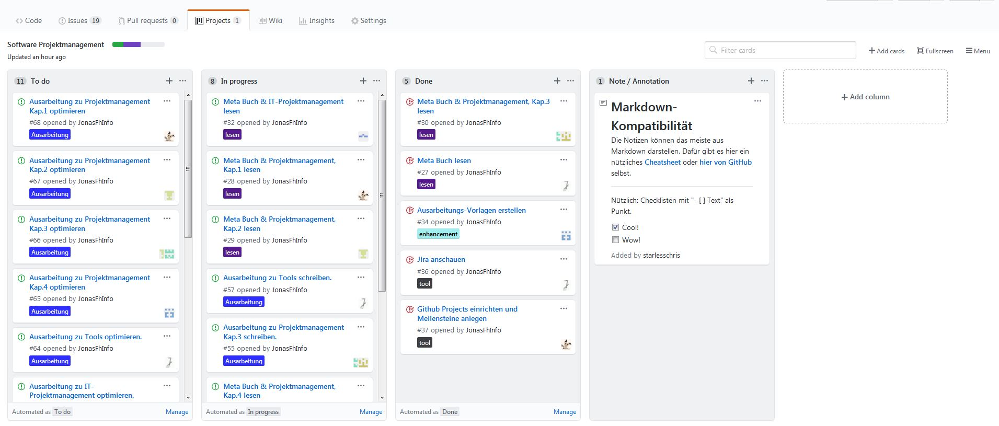
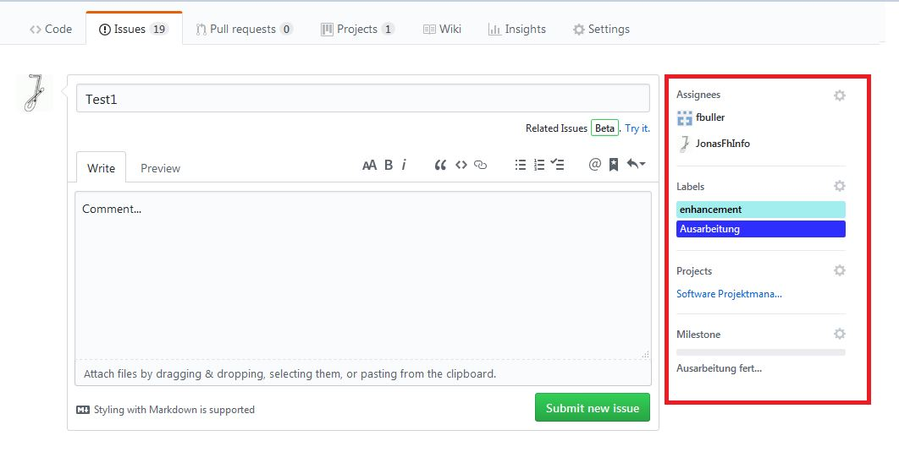
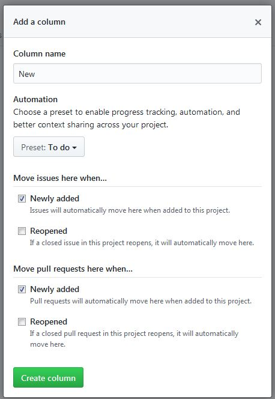
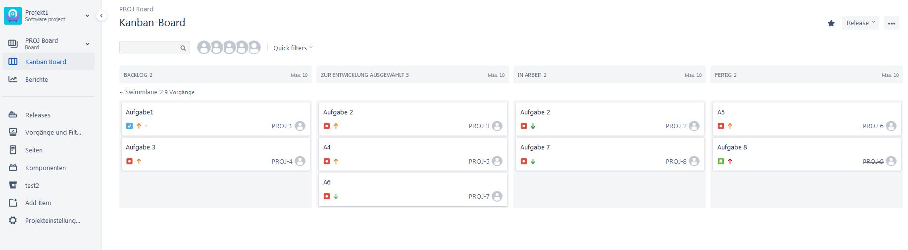
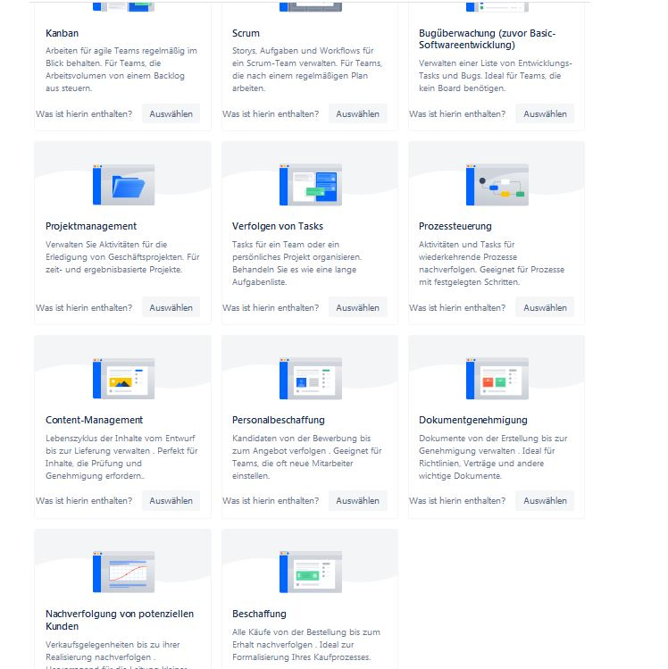
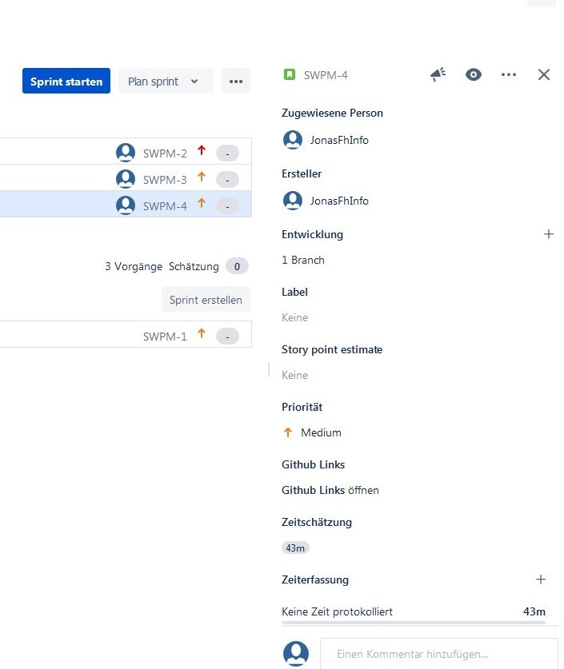
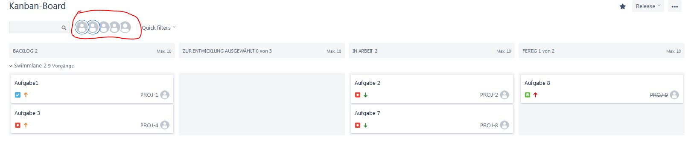
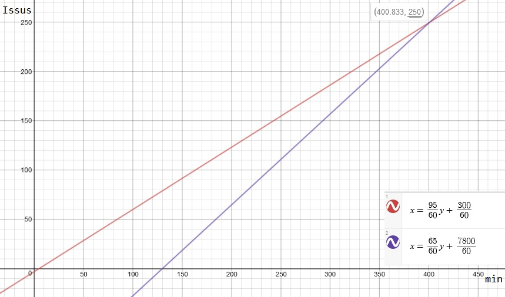

## Tooling
  
### Einleitung
Es werden Programme zur Unterstützung des Projektverlaufs vorgestellt. Hierbei wird ein besonderer Fokus auf die Einbindung von Git gelegt.

### GitHub Project
GitHub Project bietet Dashboards für GitHub Repositories oder auch ganze Organisationen mit mehreren Repositories.  
Dashboard Spalten können mit Issues, Pull-Requests und Notizen befüllt werden und können auch automatisiert werden.  
   
  
#### Projekt Anlegen 
Durch den übersichtlichen Umfang und GitHub als Grundlage, können Projekte sehr schnell angelegt werden.  
Project beschränkt sich dabei auch auf Dashboards und die Integrierung von GitHub Issus und Milestones.
   

#### Issus & Pull-Requests hinzufügen
Issues und Pull-Requests können Personen(Assigness), Labels, Projects und Milestones zugeordnet werden, wonach später auch gefiltert werden kann.  
Es können auch Notizen in Issus umgewandelt werden und dann direkt im Board bearbeited werden, andernfalls muss man erst in das jeweilige Untermenü.  
   

  
#### Automatisierung
Spalten können mit Automatisierungen versehen werden, um Issus und Pull-Requests beim Anlegen, Wiedereröffnen und Schließen direkt in die richtige Spalte zu schieben. Pull-Request können des Weiteren auch automatisch verschoben werden, wenn sie reviewed wurden oder dies noch aussteht.  
   

#### Filter
Ein Problem von GitHub Project ist, dass es sehr schnell unübersichtlich werden kann, da sich alles über das Dashboard abspielt.  
Zur besseren Übersicht kann man einen Filter verwenden, der per Texteingabe funktioniert.  
   

#### Weitere Funktionen
- Rechtesystem vorhanden (wer kann lesen, erstellen usw.)
- Kann mit anderen Funktionen wie Milestones verbunden werden
- Nicht an weitere Webseite / Dienst gebunden

### Jira (Atlassian)
Jira bietet mehrere Tools für das Projektmanagement und erlaubt es weitere Programme von Atlassian einzubinden.
Der Fokus liegt hierbei jedoch nicht auf der Software Entwicklung, sondern bietet Funktionen für ein breites Spektrum (z.B. Vorlagen für Personalbeschaffung).  
An Dashboard kann man 2 Typen erstellen (Kanab & Scrum), die auch über eigene Funktionen verfügen.
Die Benutzung gestaltet sich jedoch als kompliziert, da die Navigation sehr unintuitiv ist und es 10-20sek dauern kann, bis eine neue Seite geladen ist.
   

#### Projekt Anlegen 
Man benötigt einen Atlassian Account und kann anschließend Jira für 7 Tage testen oder 10€/Monat zahlen.  
Beim Anlegen hat man die Wahl aus mehreren Vorlagen, die auch eigene Funktionen mitbringen.
Durch den Umfang und die unübersichtliche Navigation kann es etwas dauern, bis man alles angelegt hat.  
Besonders bei den ersten malen fällt es schwer die einzelnen Funktionen zu finden, was eine hohe Einarbeitungszeit von ungefähr 2-3h mit sich bringt.  
 

#### Issus hinzufügen
Issues können eine Vielzahl von Eigenschaften zugeordnet werden. Neben den Eigenschaften, die auch von GitHub Projects unterstütz werden, kann man hier unter anderem Prioritäten und eine geschätzte Zeit festlegen.
   

#### Automatisierung 
Alles spielt sich direkt auf der Board-Seite ab, daher ist keine Automatisierung nötig. Pull-Request können nicht in das Board mit aufgenommen werden. 

#### Filter
Das Filtern innerhalb der Dashbords nach Personen geht sehr schnell und bequem über Checkboxen in Form von Profil-Bildern.
   

#### Git Einbindung
Ein weiteres Problem ist das Einbinden von Git. Hier muss man entweder ein weiteres Programm von Atlassian namens GitBucket verwenden, welches ein schlankes Programm für Online-Repos ist, oder man muss eine Erweiterung verwenden, welche GitHub und Jira verbindet, was jedoch hier leider nicht ging, da die Anleitungen auf beiden Seiten veraltet waren. 

#### Weitere Funktionen
- Rechtesystem vorhanden (wer kann lesen, erstellen usw.)
- Einbinden von Unterlagen mit dem Unterlagen-Programm "Confluence", welches viele Vorlagen bietet.
- Erstellen von Diagrammen, um den Projektverlauf nach außen zu zeigen/darzustellen.

### Vergleich
Der Vergleich ist aus der Sicht eines kleinen Projekts mit 7 Leuten, die bereits Erfahrung mit GitHub haben.

*Vergleich*  | GitHub Project | Jira 
-------- | -------- | -------- 
 Anlege-Aufwand*  | 5:00min  | 10:00min (+120:00min für Einarbeitung)
 Issue Anlegen*  | 0:45min  |  0:50min
Issue Verschieben* |  0:15min |  0:05min
Issue Schließen*  |  0:20min |  0:05min
 Git-Einbindung  | Sofortig | Umständlich über weitere App 
Rechte System  |  Über Organisationen | Intern 
 Preis  |  Kostenlos  | 10€/Monat
 
\* *Alle Zeitenangaben wurden vom Autor festgestellt.  
Die Issue-Messungen wurden in einem Projekt gemacht, dass bereits mit Issues gefüllt wurde, was zusätzliche Zeit für Filtern beanspruchte. Als Starpunkt der Messungen wurde die Projektübersicht gewählt.*

Geht man nun davon aus, dass Issus jeweils 2x verschoben werden, kommt man auf 95sek/Issu für Github und 65sek/Issu für Jira.  
Wenn man nun noch den Anlege-Aufwand mitbedenkt, lohnt es sich ab ***250 Issus*** Jira zu verwenden. Fällt die Einarbeitungszeit weg, sind es nur noch 10 Issus.  

  
Erstellt mithilfe von [desmos](www.desmos.com).

### Abschluss
GitHub Project ist sehr auf Git spezialisiert und bietet nur das Nötigste im Dashboard.  
Auch fehlt es an einer Visualisierung der Meilensteine in einem Kalender, was externe Lösungen nötig macht.  
Jira ist sehr weiter gefächert, unübersichtlich & langsam. Dafür hat man sehr viel Freiheit beim Erstellen von Dashboards, die den Projektverlauf sehr gut darstellen & organisieren lassen. 
  
Rein aus der Sicht eines auf Git basierenden Projektes, würde sich bei kleinen Projekten GitHub Project und bei großen Jira anbieten, da hier der zu erwartende Pflege-Aufwand, den großen Anlege-Aufwand rechtfertigt.

