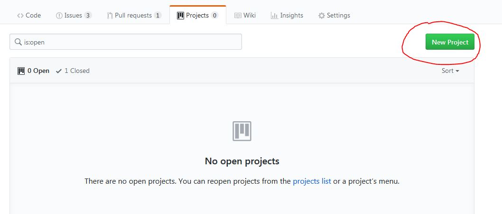
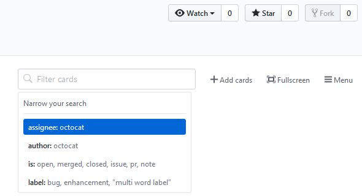

## Tooling
  
### Einleitung
Es werden Programme zur Unterstützung des Projektverlaufs Vorgestellt. Hierbei wird ein besonderer Fokus auf einbindung von Git gelegt.

### GitHub Project
GitHub Project bietet Dashboards für GitHub Repositories oder auch ganze Organisationen mit mehreren Repositories.  
Dashboard Spalten können mit Issues, Pull-Requests und Notizen befüllt werden und können auch automatisiert werden.  
   
  
#### Project Anlegen 
Durch den Übersichtlichen Umfang und GitHub als Grundlage, können Projects sehr schnell angelegt werden.   
   

#### Issus & Pull-Requests hinzufügen
Issues und Pull-Requests können Personen(Assigness), Labels, Projects und Milestones zugeordnet werden, wonach später auch gefiltert werden kann.  
Es können auch Notizen in Issus umgewandelt werden und dann direkt im Board bearbeited werden, andernfalls muss man erst in das jeweilige Untermenü.  
   

  
#### Automatiserung
Spalten können mit Automatisierungen versehen werden, um Issus und Pull-Requests beim Anlegen, Wiedereröffnen und Schließen direkt in die richtige Spalte zu schieben. Pull-Request können desweiteren auch automatisch verschoben werden, wenn sie reviewed wurden oder dies noch aussteht.  
   

#### Filter
Ein Problem von GitHub Project ist, dass es sehr schnell unübersichtlich werden kann, da sich alles über das Dashboard abspielt.  
Zur besseren Übersicht kann man einen Filter verwenden, der per Testeingabe Funktioniert.  
   

#### Weitere Funktionen
- Rechtesystem vorhanden (wer kann lesen, erstellen usw.)
- Kann mit anderen Funktionen wie Milestones verbunden werden
- Nicht an weitere Webseite / Dienst gebunden

### Jira (Atlassian)
Jira bietet mehrere Tools für Projektmangement, diese sind jedoch sehr unübersitchlich gegliedert.  
Unter anderem kann man 2 Typen von Dashbords (Kanab & Scrum) erstellen und hat über eine Roadmap, eine gute übersicht über den Zeitverlauf.   
   

#### Project Anlegen 
Durch den Umfang und die unübersichtliche Navigation kann es etwas dauern, bis man alles angelegt hat.

#### Issus & Pull-Requests hinzufügen
Issues und Pull-Requests können eine Vielzahl von Eigenschafften zugeordnet werden. Naben den Eigenschafften die auch von GitHub Projects unterstütz werden, kann man hier unter anderem Prioritäten und eine Geschätzte Zeit festlegen
   

  
#### Automatiserung 
//? Hat Automatisierung 
//   

#### Filter
Das Filtern innhalb der Dashbords geht sehr schnell und bequem über Checkboxen und Drop-Down
//   

#### Roadmap
Die Roadmap bieted eine sehr gute Möglichkeit, den Zeitverlauf des Projekts, direkt in Jira, zu visualisieren.   
//? Kann Roadmap mit Boads gekoppelt werden

#### Git Einbindung
Ein Problem ist das Einbinden von Git. Hier muss man entweder ein weiteres Programm von Atlassian namens GitBucket verwenden, welches ein schlankes Programm für Online-Repos ist,  
oder man muss eine Erweiterung verwenden, welche GitHub und Jira verbindet, was jedoch hier leider nicht ging, da die Anleitungen auf beiden Seiten veralted waren. 

#### Weitere Funktionen

#### Weitere Probleme
- Extrem Langsam (Es dauerte stets 10-20 Sekunden bis Seiten geladen hat)

### MS Project
Text

### Vergleich
Der Vergleich ist aus der Sicht eines kleines Projekts mit 7 Leuten, die bereits erfahrung mit GitHub haben.

*Vergleich*  | GitHub Project | Jira | MS Project
-------- | -------- | -------- | --------
 Anlege-Aufwand*  | 5min  | + 120min |
 Issue Anlegen*  | 45sek  |  | -
Issue Verschieben* |  15sek |  | -
Issue schließen*  |  20sek |  | -
 Git Einbindung  | Sofortig | Umständlich über weitere App | Nicht möglich
 Preis  |  Kostenlos  | 10€/Monat | Kostenlos

\* Alle Zeitenangaben wurden vom Autoren festgestellt.  
Die Issue-Messungen wurden in einem Projekt gemacht, dass bereits mit Issues gefüllt wurde, was zusätzliche Zeit für filtern beanspruchte. Als Starpunkt der Messungen wurde die Projektübersicht gewählt.

### Abschluss
GitHub Project ist sehr auf Git spezialisiert und bieted nur das nötigste im Dashboard.  
Auch fehlt es an einer Visualisierung der Meilensteine in einem Kalender, was externe Lösungen nötig macht.  
Jira ist sehr weiter gefächer, unübersichtlich & instabiel. Dafür hat man sehr viel Freiheit beim erstellen von Dashboards, die den Projektverlauf sehr gut darstellen & organiseren lassen. 
  
Rein aus der Sicht eines auf Git basiernden Projektes, würde sich bei kleinen Projekten GitHub Project und bei großen Jira anbieten, da hier der zu erwantende Pflage-Aufwand, den großen Anlege-Aufwand rechtfertigt.
// ? Was ist mit MS Project  

  
  
## Quellen
#### Quelle1 aus Buch A Seite B von Zeile C bis D 
