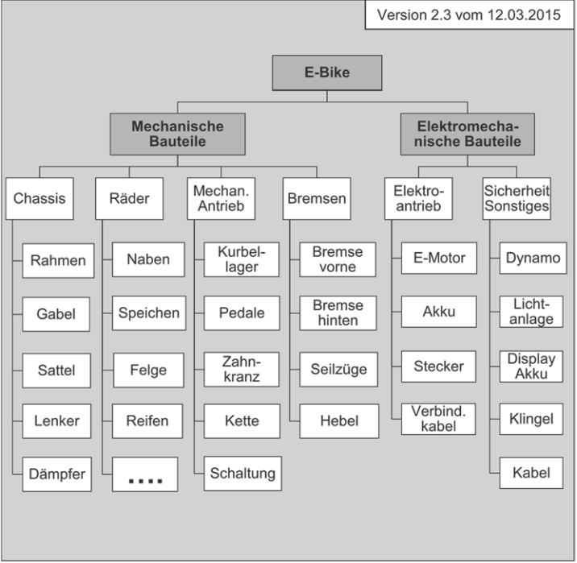
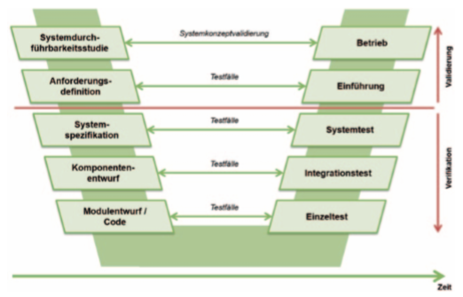
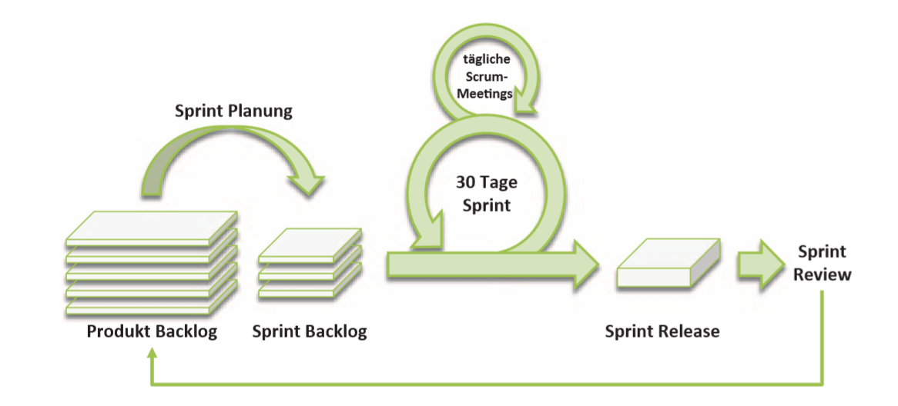

## Projekte planen
**Zusammenfassung**
Mit Beginn der Planungsphase müssen die Anforderungen für die im Projektauftrag formulierten  Ziele  und  Lieferobjekte  messbar  beschrieben  werden.  Hierzu  werden, aufbauend auf den Produktbaum, Anforderungen ermittelt, analysiert, verhandelt, gewichtet und spezifiziert und schließlich notwendige Maßnahmen und Tests zur Verifikation und Validierung geplant. Der Plan der Pläne ist der Projektstrukturplan, der im anschließenden Kapitel erläutert wird. Weitere wichtige Themen der Projektplanung sind Risikomanagement, Qualitätsplanung, Ablauf- und Terminplanung und schließlich die Aufwands- und Kostenschätzung, die jeweils in den darauffolgenden Kapiteln behandelt werden. Den Abschluss bildet die Baseline.(H. Meyer, H.-J. Reher, Projektmanagement,  2016, S. 107)  

### Anforderungen messbar definieren

##### Anforderungen ermitteln, verhandeln und beschreiben

**Was sind Anforderungen im Projekt und was bedeutet Anforderungsdefinition?**
Anforderungen entstehen aus den Projektzielen, die wiederum aus den Bedürfnissen der verschiedenen Stakeholder resultieren. Im Zentrum stehen dabei die Nutzer des zu entwickelnden Systems und der erwartete Nutzen.(H. Meyer, H.-J. Reher, Projektmanagement,  2016, S. 109) 
Bei der Anforderungsdefinition gibt es mehrere iterativ abzuarbeitenden Schritte:
- Anforderungen ermitteln
- Anforderungen analysieren, verhandeln und priorisieren
- Anforderungen spezifizieren

Während der Abarbeitung dieser Schritte wird durch ständiges austauschen und analysieren eine akzeptiere Lösung (die Baseline) vereinabart. 
Bei informationstechnischen Projekten werden dafür oft Lasten- und Pflichtenhefte erstellt.   
Bei dem Lastenheft handelt es sich um ein lösungsneutrales Dokument, welches die grundlegenden Anforderungen definiert.  
Das Projektteam erstellt daraus ein Pflichtenheft, in dem es beschreibt, wie es die vom Kunden definierten Anforderungen versteht. Dabei werden die Anforderungen genauer bis hin zu einzelnen Komponenten definiert.
Auftraggeber und Auftragnehmer verhandeln danach über die einzelnen Punkte des Pflichtenhefts, bis sich beide Parteien einig sind.

**Lastenheft-User Specification**
Das Lastenheft umfasst „die vom Auftraggeber festgelegte Gesamtheit der Forderungen an die Lieferungen und Leistungen eines Auftragnehmers innerhalb eines (Projekt-) Auftrags“ (DIN 69901-5:2009-1, S. 9).

**Pflichtenheft/technische  Spezifikation  –  Statement  of  Work/Functional  Specification**    
Das  Pflichtenheft  beinhaltet  „die  vom  Auftragnehmer  erarbeiteten  Realisierungsvorgaben auf der Basis des vom Auftraggeber vorgegebenen Lastenheftes“ (DIN 69901-5:2009-1, S. 10). 

  **Wie können Anforderungen im Projekt definiert werden?**
Im Projektauftrag sind die Projektziele dokumentiert. Genauer gesagt, sind die Ziele in folgenden Kategorien beschrieben worden:
- Der langfristige Nutzen des Projekts.
- Die Projektergebnisse bzw. Liefergegenstände, im Idealfall mit Abnahmekriterien.
- Rahmenbedingungen  sind  gesetzt: Termine,  Meilensteine  und  Endtermin  sowie  das 
Budget.

Die Liefergegenstände können grafisch als Projektergenisstruktur dargestellt werden. Bei einem einzelnen Lieferobjekt spricht man auch von einem Produktstrukturplan. Dabei wird das Objekt in seine einzelnen Teile oder Arbeitsschritte zerlegt und abgebildet. Hier am Beispiel eines E- Bikes:

Dabei werden verschiedene Lösungswege und Alternativen untersucht und die bestmögliche Lösung fixiert und beschrieben. Sobald der Auftraggeber die Anforderungen akzeptiert ist die Baseline geschaffen. Änderungen an dieser müssen genehmigt werden, bevor Sie in die Baseline aufgenommen werden.

**Wie werden Anforderungen ermittelt?**
Anforderungen leiten sich vorallem aus den Erwartungen des Auftraggebers und des späteren Nutzers ab. Bei der Softwareentwicklung wird zwischen drei unterschiedlichen Anforderungen unterschieden.
- **funktionale Anforderungen** Beschreiben, was das zu entwickelnde System leisten muss.
- **Qualitätsanforderungen** geben Kriterien für die Güte des Systems an. z.B. die Bedinungsanleitung muss 40 Seiten lang sein
- **Rahmen- oder Randbedingungen** sind Einschränkungen die aus dem Projektumfeld resultieren. z.B:
    - existierende Softwareumgebung
    - verfügbares Budget
    - existierende EU-Normen
    - vorhandene Infrastruktur

Dabei ist zu beachten, dass funktionale Anforderungen ohne Qualitätsabforderungen wertlos sind. Ein einfaches Beispiel dazu:
funktionale Anforderung:
Das Auto fährt mich von A nach B
Qualitätsanforderung:
Es soll mindestens 60km/h fahren können.  
Ohne Qualitätsanforderung kann das Auto beliebig schnell/langsam sein  

  Bei der Erstellung der funktionalen Anforderungen können Use Cases helfen. Diese beschreiben einzelne Anwendungsfälle aus der Sicht des Nutzers.
  Als Autofahrer möchte ich mit meinem Auto von A nach B kommen.
  
**Anforderungen analysieren und verhandeln**
Die noch unstrukturieren Anforderungen müssen untersucht werden. Dabei muss darauf geachtet werden, welche Anforderungen machbar, sinnvoll oder gar widersprüchlich sind. Im laufe dieses Prozesses wird die Liste der Anforderungen mit den Stackholdern ausgehandelt. Dabei müssen auch Anforderungen die nicht erfüllt werden können geklärt werden.
Um zu entscheiden welche Anforderungen wie wichtig sind ist eine genaue Analyse dieser wichtig. Es wird in drei Kategorien unterschieden (nach Kano):

| Anforderung | Vom Kunden | Wenn nicht erfüllt oder nur teilweise erfüllt | Hoher Erfüllungsgrad | Primäre Auswirkung |
|--------------------------|------------------------|---------------------------------------------------------------------------|----------------------|----------------------------------|
| Basisanforderung | Implizit vorausgesetzt | Große Unzufriedenheit | Keine Auswirkung | Unzufriedenheit |
| Leistungsanforderungen | Bewusst gefordert | Unzufriedenheit, ab gewissem Erfüllungsgrad  jedoch Zufriedenheit möglich | Zufriedenheit steigt | Unzufriedenheit  & Zufriedenheit |
| Begeisterungsanforderung | Nicht erwartet | Keine Unzufriedenheit (aber vertane Chance) | Zufriedenheit steigt | Zufriedenheit |
Erfüllungsgrad der Anforderungen und Kundenzufriedenheit nach Kano

  Dabei ist zu berücksichtigen, dass Begeisterungsanforderungen mit zunehmender Marktdurchdringung zu Basisanforderungen werden können. Zum Beispiel Bluetooth Verbindung beim Autoradio.
Bei Konflikten zwischen verschiedenen Anforderungen kann die Kano-Theorie Hinweise geben, welche Anforderung aus Kundensicht vermutlich höher gewichtet wird.

**Wie sehen die Desingtreiber aus?**
Die Einteilung in Muss- und Kann-Ziele bzw. Anforderungen dient einer ersten Gewichtung. Aber unter den Muss-Anforderungen gibt es solche, die für viele weitere abgeleitete Anforderungen bestimmend sind, die sogenannten Designtreiber. Ist in einem Projekt „Brückenbau“ einmal die Entscheidung für die Anforderung gefallen, dass Lastkraftwagen bis zu einem zulässigen Gesamtgewicht von 30 t die Brücke überqueren dürfen und können, so beeinflusst diese Anforderung die weitere Planung ganz entscheidend.(H. Meyer, H.-J. Reher, Projektmanagement,  2016, S. 117) 

**Worauf ist zu achten, wenn Anforderungen beschrieben werden?**
Bei Anforderungen ist darauf zu achten, dass Anforderungen für Teilsysteme Rückverfolgbar (**Traceable**) sind. Das heißt, es muss ersichtlich sein aus welcher Anforderung sich die untergeordnete Anforderung ableitet. Das hilft vorallem, wenn sich Anforderungen ändern. Dann kann man leicht überprüfen, ob diese Änderungen das Gesamtsystem beeinflussen.
  Anforderungen sollten **SMART** sein.
- **Specific**- Eindeutig: Die Formulierung der Anforderung erlaubt nur eine gülitge Interpretation. 
- **Measurable**- Prüfbar: Jede Anforderung ist mittels definierter Kriterien überprüfbar
- **Accepted**- Akzeptiert: Anforderungen müssen von allen Parteien akzeptiert sein
- **Reasonable**- Gültig: Die Anforderung entspricht den Bedürfnissen der Stakeholder
- **Traceable**- Nachvollziebar: Der Uhrsprung der Anforderung und Ihre Entwicklung ist nachvollziehbar

Diese Anforderungen werden vom **Systemarchitekt** mithilfe der Projektleitung, der Qualitätsmanager und Mitarbeiter aus den Fachabteilungen erstellt.

##### Das Verifizieren und Validieren planen

- Verifikation    Verifikation zielt darauf ab, die Dinge richtig zu tun (doing things right). 
Mit Hilfe definierter Vorschriften wird geprüft, ob vorliegende Ergebnisse den definierten 
Anforderungen entsprechen (Ebert 2014, S. 182).
 - Validierung    Validierung zielt darauf ab, die richtigen Dinge zu tun (doing the right 
things). Die Validierung prüft die Ergebnisse daraufhin, ob das spätere Ergebnis den ange-
nommen Nutzen bringt (Ebert 2014, S. 183). Die Stakeholder sind in den Validierungs-
prozess einzubinden (INCOSE 2012, S. 127).
 Einfach gesagt wird bei der Verifikation aus der Sicht des Projekteams geschaut ob das Ergebniss richtig ist, während bei der Validierung aus der Sicht der Stakeholder geschaut wird, ob das System den erwarteten Wert für den Kunden liefert.
 **Weshalb muss das Verifizieren und Validieren im Projekt geplant werden?**
 Das Verifizieren und Validieren ist wichtig für die Qualitätssicherung eines Systems. Durch die geplanten Schritte, kann man leichter überprüfen, ob die geforderten Qualitätsstandarts erfüllt und sein Projekt somit auf Kurs ist.
Dabei ist zu beachten, das diese Anforderungen eindeutig und messbar sein sollen.
 
 **Wie wird Verifikation und Validierung in Projekten gehandhabt?**

### Vorgehensmodelle

Vorgehensmodelle beschreiben die Planung zur Entwicklung einer Software in aufeinanderfolgenden begrenzten Phasen. Die meisten Vorgehensmodelle lassen sich in die Phasen Problemanalyse, Sollkonzept, Programmierung, Test, Inbetriebnahme und Wartung unterteilen. In der Problemanalysephase wird die Problemstellung untersucht. Beim Sollkonzept werden die Zielvorgaben definiert sowie Zwischenschritte und Endzustand beschrieben. Mit dem Sollkonzept lässt sich ein Anforderungsprofil beziehungsweise ein Pflichtenheft erstellen. In der Phase Programmierung wird die eigentliche Arbeit absolviert, die Software wird geschrieben. Die Testphase überprüft die Funktionalität der Software. Hierfür werden geeignete Testfälle bedacht. Während der Phase Inbetriebnahme wird die Software ausgeteilt und "ins Produktivsystem" (IT-Projektmanagement, Seite 31, Zeile 3) eingespielt.Unter realen Bedingungen wird die Software in Betrieb genommen. Zum Schluss folgt die Phase Wartung. In dieser Phase werden die Fehler, die Unteranderem während der Inbetriebnahme erschienen sind, behoben. Gegebenenfalls werden neue Anforderungen sowie neue Funktionalitäten dem Projekt angefügt und bearbeitet. 

**Klassische Vorgehenesmodelle**

Die Vorgehensmodelle werden in drei Typen klassisch, modern und agil kategorisiert. Zu den klassischen Vorgehensmodellen gehört unter anderem das Wasserfallmodell. Beim Wasserfallmodell verlaufen die acht Phasen sequenziell ab. Zu diesen acht Phasen gehört die Problemanalyse, die Systemspezifikation, der Grobentwurf, der Feinentwurf, die Implementierung, die Integration, die Installation und der Betrieb und die Wartung, die man in der Abbildung X.Y sehen kann. Diese Phasen werden nacheinander in der genanten Reihenfolge abgearbeitet. Der Übergang von Phase A nach Phase B geschieht erst, wenn die Validierung erfolgreich war, sprich es treten keine "erheblichen Mängel auf". Einer der Vorteile der klassischen Vorgehensmodellen ist, dass diese einfach gestrickt sind und für große Projekte geeignet sind. Zudem gibt es eine "hohe Effizienz bei bekannten und konstanten Anforderungen".(IT-Projektmanagement Seite 33 Zeile 17) problematisch und mit hohen Kosten verbunden sind die Änderungen der Anforderungen. Diese können bei den klassischen Vorgehensmodellen meist auch nicht geändert werden. Da die Phasen der klassischen Vorgehensmodelle sequenziell ablaufen, werden Fehler erst im späteren Projektverlauf ausfindig gemacht. Außerdem treten die Risiken auch zum Ende auf. 

Abbildung: Wasserfallmodell

**Moderne Vorgehensmodelle**

Im Gegensatz zu den klassischen Vorgehensmodellen bieten die moderne Vorgehensmodellen an neue Änderungen während des Projektverlaufs umzusetzen. Das V-Modell gehört zu diesen modernen Vorgehensmodellen. Es basiert auf das Wasserfallmodell und hat nicht nur Fokus auf die Entwicklung, sondern auch auf die "Qualitätssicherung, Konfigurationsverwaltung und Projektmanagement"(IT-Projektmanagement Seite 35 Zeile 4-5). Im Verlauf der Jahre wurde das V-Modell weiterentwickelt und das V-Modell 97 wurde zum Standard in Bundesbereichen sowie mit dem Nachfolger V-Modell XT in der Öffentlichkeit. In der Abbildung X.Y ist das V-Modell zu sehen. Die linke Seite liefert die "Anforderungen mit lösungsspezifischen Informationen wie Architektur und Design" (https://se-trends.de/was-ist-eigentlich-das-v-modell/). Die rechte Seite ist für die Verifizierung und Validierung zuständig. Die Spitze des V-Modells entspricht dem "fertigen Produkt"(https://se-trends.de/was-ist-eigentlich-das-v-modell/). 
Die Phasen auf der linken Seite stellen die Informationen zum Erstellen der Tests für die Phasen auf der rechten Seite zur Verfügung. Die Tests der Phase X auf der rechten Seite können aber erst durchgeführt werden, wenn die Tests vorherige Phase erfolgreich durchgeführt wurden. Das V-Modell enthält nicht eine fixe Anzahl an Phasen. Diese sind abhäng von der Entwicklungstyp. In der Regel treten die folgenden Phasen auf: Anforderungsdefinition, Systemanforderungen, Systemarchitektur, Komponentenspezifikation, Komponetentests, Integrationstests, Systemtests und Abnahmetests. Zu den Vorteilen des V-Modells gehört unter anderem, dass die Risiken anders als beim Wasserfallmodell früh erkannt werden können. Zudem können Änderungen an den Anforderungen besser angepasst werden. Zu den Nachteilen gehören der hohe Aufwand der Projektbeteiligten sowie ein "komplexes Projektmanagement".

Abbildung: V-Modell

**Agile Vorgehensmodelle**

Die agilen Vorgehensmodelle basieren auf die japanische Automobilindustrie, diese verfolgt das Ziel eine Minderung der Ressourcenverschwendung und eine rapide Arbeitung der Kundenaufträge zu erreichen. Dies geschieht durch den Einsatz von Iterationen und auf Kosten der Entwurfphase, weil diese auf ein Minimum reduziert wird. Agile Vorgehensmodelle charakterisieren sich durch kurze Iterationen aus. Nach jeder Iteration steht ein Ergebnis für den Kunden parat. Scrum ist eines der agilen Vorgehensmodelle (vgl. Abbildung X.Y). Das Scrum Modell wird durch folgende Artefakte und Rollen beschrieben. Zu den Artefakten gehört unter anderem das Produkt Backlog, welches zum Projekt bezogenen Anforderungen enthält. Diese Anforderung werden von der Rolle Product Owner
für den kommenden Sprint geplant und in dem Artefakt Sprint Backlog gesammelt. Alle Anforderungen im Sprint Backlog werden bis zum Ende des Sprints von der Rolle Team abgearbeitet. Am Ende des Sprints, welches das Artefakt Release wiedergespiegelt, resultiert ein lauffähiger Prototyp, welches der Kunde begutachten kann. Die Dauer von einem Sprint wird zu Beginn festgelegt. Es folgen so viele Sprints, bis das Produkt als fertig bezeichnet wird bzw. wenn alle Anforderungen im Produkt Backlog abgearbeitet wurden.Zu guter Letzt gibt es noch die Rolle Scrum Master. Der Scrum Master ist nicht teil des Projektteams und hat keine Autorisierungsmacht. Er ist stattdessen eher eine "Art Mentor"(IT-Projektmanagement Seite 40 Zeile 1) und zuständig 
für die Umsetzung des Projekts. Zu den Vorteilen der agilen Vorgehensmodelle gehört unter anderem, dass Risiken früh entdeckt werden können und dass das Team recht flexibel ist, da es eigenständig die Aufgaben für den jeweiligen Sprint plant. 
Die Eigenverantwortklichkeit kann, aber auch ein Nachteil sein. Des Weiteren verlangt das Modell einen hohen Kommunikationsaufwand. Aufgrund der fehlenden Dokumentationen in den agilen Methoden fehlt meist die Dokumentation der Ergebnisse.

Abbildung: Scrum
 
| Ebene | Produktbaum | Spezifikation | Abgeleitet aus | Amf.-Nr. | Anforderung | Verifikationsmethode |
|--------------|----------------------|---------------|----------------|----------|----------------------------------------------------------------------------------------|----------------------|
| Gesamtsystem | E-Bike | E-B | - | E-B 01 | Das E-Bike soll elektrisch angetrieben werden | Review of Design |
| Teilsystem | Elektrischer Antrieb | E-A | E-B 01 | E-A 11 | Der elektrische Antrieb soll eine Geschwindigkeit des E-Bikes von max. 30 km/h liefern | Test |
| Komponente | Elektromotor | E-M | E-A 11 | E-M 111 | Der Elektromotor soll eine Leistung von 450W liefern | Test |
| Komponente | Akku | E-Ak | E-A 11 | E-AK 2 | der Akku (24V) soll eine Nominal-Kapazität von 20 Ah besitzen | Test |

**Wie wird validiert?**

**Wer plant das Verifizieren und Validieren und wann?**
 
### Die Projektstruktur gestalten

**Der Projektstrukturplan**

Der Projektstrukturplan (PSP) ist das Ergebnis einer Gliederung des Projekts in einzelne Teilaufgaben und Arbeitspakete. Dabei ist ein Arbeitspaket das unterste Glied des PSPs und dieses lässt sich nichtmehr sinvoll aufteilen.  

Der Projektstrukturplan bietet eine Hilfestellung bei den zentralen Aspekte eines Projekts.

1. Er liefert ein **vollständiges Abbild** der zu erledigenden Aufgaben. Es sind dabei alle Aufgaben zu identifizieren, die zur erfolgreichen fertigstellung des definierten Liefergegenstandes benötigt werden.
2. Die **Verantworlichkeiten** werden zugeordnet. Jedem Arbeitspaket wird ein Arbeitspaketmanger zugeordnet und zusätzlich werden interne und externe Parteien berücksichtigt(z.B. Lieferanten)
3. Aufwandsabschätzung.  
Bei jedem Arbeitspaket muss der Aufwand und die benötigten Ressourcen abgeschätzt werden. Diese Schätzungen fließen dann in die Kostenplanung mit ein.
4. **Bezugssystem**  
Es entsteht ein Bezugsystem, mit dessen Hilfe man Fortschrittsmessungen und Soll-Ist-Vergleiche auf Basis der einzelnen Arbeitspakete durchführen kann.

**Wie wird ein Projektstrukturplan erstellt?**
Die folgenden Schritte haben sich bewährt:
•  Sammeln der zu erledigenden Aufgaben. Ausgangspunkt sind die Lieferobjekte. Hierzu 
zählen  der  Projektgegenstand  ebenso  wie  eventuell  notwendige  unterstützende  Sys-
teme, z. B. Vorbereitung von Produktionsanlagen, Einrichten einer EDV-technischen 
Infrastruktur.
•  Strukturieren und Definieren sinnvoller Arbeitspakete und Bestimmen der Arbeitspa-
ketverantwortlichen.
•  Verankern der Prozesse des Projektmanagements und des Systems Engineerings im 
Projektstrukturplan.
•  Mehrfaches Prüfen und Überarbeiten des Projektstrukturplans.
•  Erstellen der Arbeitspaketbeschreibungen.
(H. Meyer, H.-J. Reher, Projektmanagement,  2016, S. 133)

Um die Aufgaben zu sammeln, kann man drei Vorgehensweisen nutzen. Bei der "Top-Down" Methode wird zuerst auf das Projekt als ganzes geschaut und dann geht man immer mehr ins Detail. Diese Methode ist besonders gut geeignet, wenn es bereits Erfahrungen mit ähnlichen Projekten gibt.  
Bei dem "Bottom-Up" Ansatz  geht man vom Detail zum Ganzen. Das heißt man schaut sich an wie einzelne Arbeitspakete aussehen könnten und wie diese strukturiert werden können. Dieses Verfahren ist bei Projekten mit hohem Inovationsgehalt gut geeignet.
Die dritte Methode ist das "Yo-Yo-Verfahren" Dabei werden beide Ansätze kombiniert und abwechselnd durchgeführt um die Stärke beider Verfahren zu nutzen.

**Gliederung des Projektstrukturplans**
Beim erstellen einer neuen Ebene im PSP muss beachtet werden, dass es ein einheitliches Gliederungsprinzip gibt, dass nach "DIN-Normn 69900 ff" zulässige Orientierungen bietet:
- Funktionsorientierte Gliederung
Im Vordergrund steht die Art der auszuführenden Tätigkeit.
- Objektorientierte Gliederung
Der Projektgegenstand wird in seine einzelnen Komponenten, Baugruppen oder Einzelteile zerlegt.
- Zeitorientierte Gliederung
Für eine zeitorientierte Gliederung betrachtet man den Ablauf oder die Phasen des Projektes.

Dabei wird meistens eine gemischtorientierte Gliederung verwendet. Dabei ist zu beachten, dass in einer Ebene immer nur eine Gliederung verwendet wird und nur zwischen den Ebenen gewechselt wird.

Die Erstellung des PSP erfolgt durch mehrfaches Prüfen und Überabeiten des Projektstrukturplanes. Dabei können folgende Fragen helfen:

**Das Projektteam:**
•  Identifizieren sich alle Teammitglieder mit der Projektstruktur oder würden sie das Pro-
jekt ganz anders strukturieren?
•  Sind die Interessen und Fähigkeiten der Teammitglieder berücksichtigt?
•  Gibt es für jedes Arbeitspaket ein verantwortliches Teammitglied?

**Eigenleistung oder Fremdleistung** (Make-or-Buy), verfügbare Ressourcen:
•  Welche Ressourcen sind verfügbar?
•  Welche Kompetenzen sind vorhanden?
•  Was soll in Eigenleistung geschehen?
•  Für welche Aufgaben (Teilaufgaben und/oder Arbeitspakete) sollen externe Unterauf-
tragnehmer eingesetzt werden?

**Vollständigkeit:**
•  Bildet  der  Projektstrukturplan  alle  im  Rahmen  des  Projekts  zu  erstellenden  Liefer-
objekte und durchzuführenden Aufgaben ab? Eine zu detailgenaue Strukturierung zu 
Beginn der Planungsphase engt Handlungsspielräume jedoch unnötig ein. Deshalb ist 
es vorteilhaft, dem Prinzip der rollierenden Planung zu folgen und weiter in der Zu-
kunft liegende Aufgaben nur grob als übergeordnetes Arbeitspaket zu erfassen und erst 
später zu detaillieren.
•  Besteht tatsächlich jedes übergeordnete Element exakt zu 100 % aus den untergeordne-
ten Elementen (100-Prozent-Regel)?
•  Sind die Arbeitspakete überschneidungsfrei und welche Schnittstellen existieren zu an-
deren Arbeitspaketen?
•  Werden alle notwendigen unterstützenden Funktionen aus Sicht des Projektmanage-
ments und des Systems Engineerings berücksichtigt?

**Anzahl der Arbeitspakete**:
•  Hat der Projektstrukturplan mehr als vier Ebenen?
•  Ist der Aufwand für die Planung und Kontrolle der Arbeitspakete angemessen?
•  Lässt der Detaillierungsgrad den Verantwortlichen ausreichend Spielraum?
•  Sind die Lieferobjekte sichtbar und hinreichend konkret verankert?
•  Ist die Zahl der Arbeitspakete hinreichend minimiert?
•  Ist die Zahl der Schnittstellen optimiert?

**Managementprozesse**:
•  Welche Prozesse werden zentral, welche dezentral verankert?
•  Ist das Verhältnis der Anzahl Arbeitspakete des Projektmanagements und der Anzahl 
Arbeitspakete für die Erarbeitung des Projektgegenstandes im Verhältnis zueinander 
angemessen?
•  Wie wird die Steuerung der Unterauftragnehmer in der Projektstruktur verankert?

**Termine: Planbarkeit und Fortschrittsmessung:**
•  Inwiefern soll der zeitliche Ablauf eine Rolle bei der Gestaltung der Projektstruktur 
spielen?
•  Ist die Dauer der Arbeitspakete kürzer als zwei Berichtsperioden, besser noch als eine 
Berichtsperiode, bei monatlichen Fortschrittsberichten also kürzer als zwei Monate, 
besser noch kürzer als einen Monat? Ausgenommen sind fortlaufende Prozesse wie 
z. B. das Termincontrolling.
•  Wie kann der Fortschritt gemessen werden (vgl. auch das Thema Projektfortschritt in 
Abschn. 4.2)?

**Kosten:**
•  Erlaubt der Projektstrukturplan eine erste übersichtliche Kostenschätzung und Vertei-
lung des Budgets (Cost Breakdown Structure), z. B. durch prozentuale Top-down-Zu-
ordnung auf die Teilaufgaben und Arbeitspakete?
•  Sind  die  Arbeitspakete  so  definiert,  dass  ein  Sachkundiger  den  Aufwand  schätzen 
kann?
•  Sind alle Kosten, die im Projekt entstehen, vollständig als Kostenart identifiziert und 
den vorhandenen Teilaufgaben und Arbeitspaketen zugeordnet (z. B. Projektbüro für 
allgemeine Tätigkeiten, Reisekosten)?
•  Wie  sind Arbeiten  oder  Mittel  für  eine  möglicherweise  notwendige  Fehlerberarbei-
tung oder Nacharbeit erfasst, z. B. dezentral in den Arbeitspaketen oder sind sie zentral 
einem Risikobudget zugeordnet?
•  Erlaubt die Projektstruktur die Darstellung von Ergebnis- und Zahlungsmeilensteinen 
im Terminplan?
•  Können für die Zukunft wichtige Kosteninformationen generiert werden oder verfäl-
schen z. B. Reisekosten das Bild, wenn für spätere Projekte Entwicklungskosten ana-
lysiert werden sollen?
(H. Meyer, H.-J. Reher, Projektmanagement,  2016, S. 136,137)

**Arbeitspaketbeschreibung**
Jedes Arbeitspaket sollte einen eindeutigen Namen haben und sich nach Möglichkeiten nicht wiederholen. Die Arbeitspaketbeschreibung dient der Auftragserklärung. Nachfolgend ein Muster für eine Arbeitspaketbeschreibung:

| Arbeitspaket (AP) Definition |  | Projekt: |
|------------------------------|------------------------------------------------------------------------------------------------------------------|-------------|
| Projektphase: | PLANUNG | PSP Code: |
| Teilaufgabe: |  | AP Name: |
| Produkt/Teilsystem: |  | Version: |
| Ausführende Einheit: |  | AP Manager: |
| AP Startereignis: |  | Termin: |
| AP Endereignis; |  | Termin: |
| AP Dauer in Tagen: |  |  |
| AP Aufwand: | Wieviele Personentage sind erforderlich? Welche Materialien und Geräte werden benötigt? Welche Kosten entstehen? |  |
| AP Input: | Welche Ergebnisse müssen vorliegen, um mit dem Arbeitspaket zu beginnen? |  |
| AP Lieferobjekt (Output): | Was liegt nach Beendigung des Arbeitspakets vor? |  |
| AP Aufgabe: | Was soll getan werden? |  |
| AP Grenzen: | Was gehört nicht mehr zum Arbeitspaket? |  |
| AP Schnittstellen: | Welche anderen Arbeitspakete im Projekt sind betroffen? |  |
| AP Fortschritt: | Wie wird der Leistungsfortschritt des Arbeitspakets gemessen? Woran orientiert sich der Fertigstellungsgrad? |  |
| AP Risiken: | Welche Ereignisse können den Erfolg beeinflussen? |  |
| AP Qualität: | Welche Abnahmen- bzw. Prüfkriterien werden angewandt? |  |
| Sonstiges: | z.B: zu berücksichtigende Vorgaben/Standards/Formulare |  |

Durch die genaue Dokumentation der einzelnen Arbeitspakete werden Lücken und Überscheidungen aufgezeigt.

**Abschluss**
Zum Schluss dieses Prozesses sollte ein vom Auftraggeber genehmigter Projektstrukturplan stehen.

