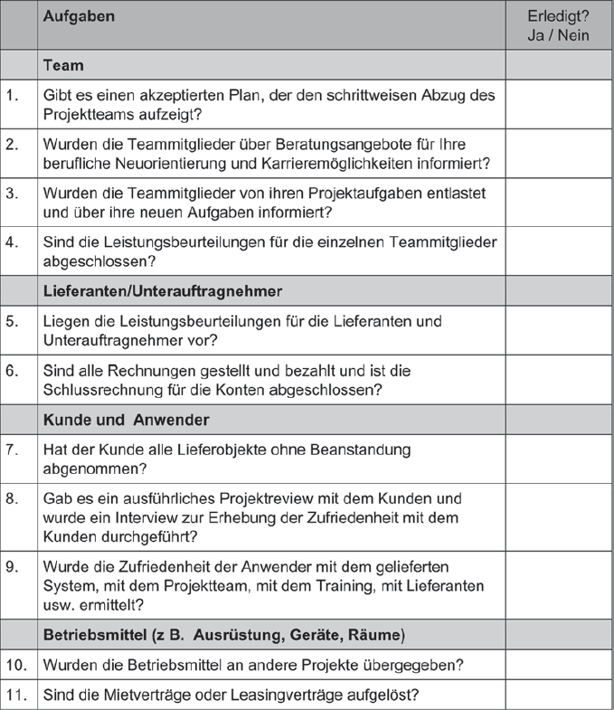

## Projekt abschließen

Die Abschlussphase eines Projektes stellt die letzte Phase dar. In dieser Phase ist das Produkt bereits ausgeliefert und geht in die Nutzungsphase über, während die letzten, abschließenden Aufgaben erledigt werden. Die Aktivität der Teammitgleider sinkt, da Aufgaben auf der Beziehungsebene im Vordergrund stehen:
- Neuorientieren
- Bilanzieren
- Sich-Besinnen
- Erfahrungen austauschen
- Abschied nehmen

Aufgrund dessen ist es von Vorteil, Aufgaben der Beziehungsebene von Aufgaben auf der Sachebene zu trennen. Um die Abarbeitung der Aufgaben der Sachebene so einfach wie möglich zu gestalten, nutzt man eine Checkliste an Fragen:

#### Abschließende Aktivitäten planen

Sind diese Aufgaben zufriedenstellend erfüllt, beginnen die restlichen abschließenden Aufgaben:
- Planung, Vorbereitung und Durchführung von Projektabschlusssitzungen mit dem Kernteam. Dabei wird unterschieden:
  - Eine Sitzung zur Würdigung der Arbeit
  - Ein Workshop zur Auswertung der Erfahrungen
- Nachkalkulation und Analyse der Projektkosten
- Systematische Archivierung sämtlicher Projektdokumente
- Bewertung des Projekts und ggf. auch der Projektmitarbeiter
- Erfassung, Auswertung und Dokumentation der gesammelten Erfahrungen
- Formale Auflösung der Projektorganisation
- Auflösung des Projektbüros
- Informationen bezüglich des Projektabschlusses an den Kunden, interne Auftraggeber und das Team weiterleiten
- Dank an alle Projektmitgleider aussprechen, möglichst persönlich.

#### Projektauswertung und Abschlussbericht

**Projektauswertung**  
Das Ziel der Projektauswertung ist es, zu bestimmen, inwiefern die angestrebten Projektziele erreicht wurden. Zur Beurteilung werden Daten sowohl von der Beziehungsebene als auch von der Sachebene:
- Beziehungsebene: Wichtige Stakeholder teilen Ihre Meinungen mit, z. B. durch Fragebögen.
- Sachebene: Es wird ermittelt, ob Kosten, Zeit, Leistungsumfang und Qualität so eingehalten wurden, wie es die Projektziele vorausgesetzt haben.

Die Projektnachkalkulation dient der Beurteilung der Wirtschaftlichkeit des Projekts und bietet wertvolle Erfahrungen und Informationen für zukünftige Projekte. Aspekte, die bei der Projektnachkalkulation beachtet werden sollten, sind:
- Kostenplan (Budget)
- Mehrleistung
- Minderleistung
- Revidiertes Budget
- Istkosten
- Abweichung
- Begründung

**Abschlussbericht**  
In dem Abschlussbericht werden alle wichtigen Informationen, die zum Erfolg zukünftiger Projekte beisteuern könnten, zusammengefasst und aufgeschrieben. Enhalten sein können Ergebnisse wie:
- Erweiterte oder neue Checklisten zur Identifizierung von Risiken oder zur Identifikation von Stakeholdern.
- Vorschläge zu Anpassungen von Standardphasenplänen, -strukturplänen, -berichten und -formaten.
- Vorschläge für neue oder verbesserte Qualitätsziele

#### Die Zukunft
Damit die zusammengetragenen Verbesserungsvorschläge in kommenden Projekten übernommen werden, muss es einen Verantwortlichen geben, der sich um die Einpflegung dieser kümmert. In Unternehmen gibt es dafür das Projektmanagementoffice.
Wird diese Aufgabe sorgfältig erfüllt, ist systematisch gesichert, dass jedes kommende Projekt iterativ das Projektmanagement selber verbessert.
