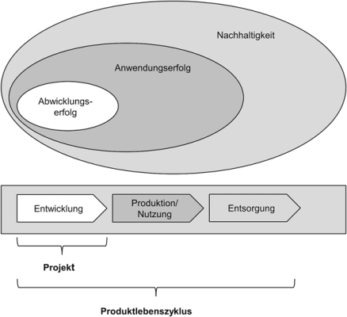
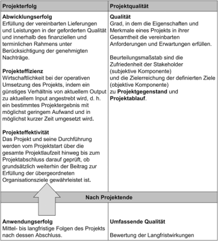

## Kapitel 1: Projektmanagement verstehen

1. Projekte und ihre Rolle im Produktlebenszyklus
2. Mit dem magischen Zieldreieck zum Projekterfolg
3. In Etappen zum Erfolg – Phasen und Meilensteine
4. Den Überblick behalten
5. Projektmanagement boomt

---
## Projekte und ihre Rolle im Produktlebenszyklus

- komplexe Projekte wie *Mondlandung 1969* nur dank PM möglich

--
- allgegenwärtig & sehr verschieden  

--
Projekt nach DIN Norm:
- Vorhaben, einmalig durch:
 - Ziel
 - Zeit
 - Finanzielles
 - Personelles  

--
Nach verschiedenen Autoren:
- Interdisziplinäre Teamarbeit (Da alle versch. Erfahrung haben)

--
- Neuartigkeit, fortschreitende Konkretisierung (Zu Beginn Unsicherheit)
???
&rightarrow; Koordination & Arbeitsteilung gefragt
- Projekt definieren: wann soll PM-Methodik genutzt werden? (je nach Organisation speziell)

---
## Projekte und ihre Rolle im Produktlebenszyklus

- Projektmanagement besteht aus:
  - Spezifikationen, Pläne und Vorgehensweise an Erwartungen und Anliegen der Stakeholder anpassen
  - Klare und erreichbare Ziele definieren und Anforderungen identifizieren
  - Termine und Kosten planen und einhalten
  - Liefergegenstände in der geforderten Qualität liefern
  - Das Projekt mit Gewinn abschließen

---
- Ergänzung der DIN:
  - Es werden spezielle Techniken und Mittel benutzt
  - Projekte müssen initiiert und gesteuert werden

---
#### 1.1.1 Product Life Cycle vs. Project Life Cycle

- Product Life Cycle (in Wirkungsforschung):
  - Idee, Entwicklung, Produktion, Nutzung, Recycling, Entsorgung
- Project Life Cycle meist nur kleiner Teil des Product Life Cycle
  - Wenn Produkt fertig und geliefert, dann Projekt zuende
- Wenn Product Life Cycle > Project Life Cycle, dann zukünftige Entwicklungen und Nutzungsszenarien erahnen wie z.B. Wartungsbedarf

---

---
- Projekt planen:
  - auf Projektdauer & auf Nutzung der Projektergebnisse (im Product Life Cycle) achten
  - wenn nötig / gewollt auch Nachhaltigkeit einbeziehen  
  
> Je weiter die Planung in die Zukunft reicht, desto komplexer und risikoreicher wird das Projekt.

---
- Erfolge:
  - Abwicklungserfolg: Kosten, Termine, Leistung (= technischer Erfolg)
  - Anwendungserfolg: Erfolg des Nutzers beim Nutzen
  &rightarrow; Projekt kann erfolgreich durchgeführt sein, aber auf Markt nicht ankommen

---
### 1.2 Mit dem magischen Zieldreieck zum Projekterfolg

- Kunde & Nutzer nicht immer identisch
  - Kunde kann Organisation oder einzelne Person sein, Beispiele:
    - Verbraucher
    - Endanwender
    - Einzelhändler
    - Käufer
- Nicht nur Kunde, Alle (auch Stakeholder) sollen zufrieden sein
???
- Kunde zufrieden, wenn seine Anforderungen zum möglichst größten Teil erfüllt

---

---
- Projekteffizienz: max. Output bei min. Input
  &rightarrow; Projekt mit möglichst geringem Aufwand in möglichst kurzer Zeit umsetzen
- Projekteffektivität: iteratives Bewerten des Anwendungserfolgs während das Projekt läuft