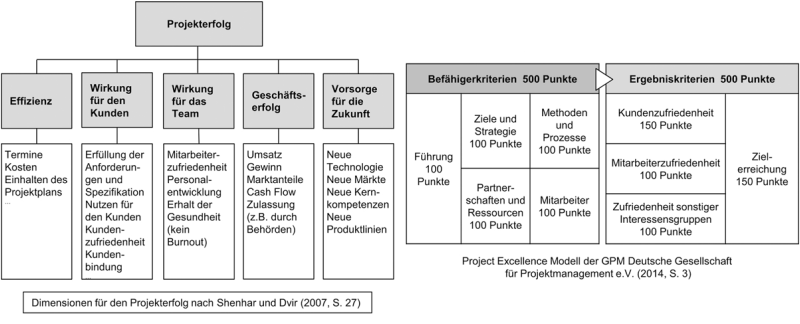

## Kapitel 1: Projektmanagement verstehen

1. Projekte und ihre Rolle im Produktlebenszyklus

2. Mit dem magischen Zieldreieck zum Projekterfolg

3. In Etappen zum Erfolg – Phasen und Meilensteine

4. Den Überblick behalten

5. Projektmanagement boomt

---
## Projekte und ihre Rolle im Produktlebenszyklus

- komplexe Projekte wie *Mondlandung 1969* nur dank PM möglich  

--

- allgegenwärtig & sehr verschieden  

--

- Projekt (nach DIN): Vorhaben, einmalig durch:
  - Ziel
  - Zeit
  - Finanzielles
  - Personelles  

--

- Nach verschiedenen Autoren:
  - Interdisziplinäre Teamarbeit (Da alle versch. Erfahrung haben)  

???
&rightarrow; Koordination & Arbeitsteilung gefragt

--

  - Neuartigkeit, fortschreitende Konkretisierung (Zu Beginn Unsicherheit)  

???
- Projekt definieren: wann soll PM-Methodik genutzt werden? (je nach Organisation speziell)

---

## Projekte und ihre Rolle im Produktlebenszyklus

- Projektmanagement besteht aus:

  - Spezifikationen, Plänen & Vorgehensweisen

???
- an Erwartungen und Anliegen der Stakeholder anpassen

--

  - Ziele definieren & Anforderungen identifizieren

???
- Klare & erreichbare Ziele

--

  - Termine & Kosten

???
- planen und einhalten

--

  - Liefergegenstände in geforderten Qualität liefern

--

  - Das Projekt mit Gewinn abschließen

???
- Ergänzung der DIN:
  - Es werden spezielle Techniken und Mittel benutzt
  - Projekte müssen initiiert und gesteuert werden

---

## Projekte und ihre Rolle im Produktlebenszyklus
### Product Life Cycle vs. Project Life Cycle

- Product Life Cycle (in Wirkungsforschung):

  - Idee
  - Entwicklung
  - Produktion
  - Nutzung
  - Recycling
  - Entsorgung

--

- Project Life Cycle meist nur kleiner Teil des Product Life Cycle

  - Wenn Produkt fertig und geliefert &rightarrow; Projekt zuende

--

- Wenn Product Life Cycle > Project Life Cycle &rightarrow; zukünftige Entwicklungen und Nutzungsszenarien erahnen

???
wie z.B. Wartungsbedarf

---

## Projekte und ihre Rolle im Produktlebenszyklus

---

## Projekte und ihre Rolle im Produktlebenszyklus

- Projekt planen:
  
  - auf Projektdauer & Nutzung der Projektergebnisse (im Product Life Cycle) achten

--

  - wenn gewollt auch Nachhaltigkeit einbeziehen

--

> "Je weiter die Planung in die Zukunft reicht, desto komplexer und risikoreicher wird das Projekt."

---

## Projekte und ihre Rolle im Produktlebenszyklus

- Erfolge:

  - Abwicklungserfolg: Kosten, Termine, Leistung (= technischer Erfolg)

--

  - Anwendungserfolg: Mittel-/langfristige Folgen, Erfolg des Nutzers beim Nutzen  

    &rightarrow; Projekt kann erfolgreich durchgeführt sein, aber auf Markt nicht ankommen

---
## Mit dem magischen Zieldreieck zum Projekterfolg

- Kunde & Nutzer nicht immer identisch

--

- Kunde kann Organisation oder einzelne Person sein, Beispiele:

--

  - Verbraucher
  - Endanwender
  - Einzelhändler
  - Käufer

--

- Nicht nur Kunde, Alle (auch Stakeholder) sollen zufrieden sein

???
- Kunde zufrieden, wenn seine Anforderungen zum möglichst größten Teil erfüllt

---

## Mit dem magischen Zieldreieck zum Projekterfolg

---

## Mit dem magischen Zieldreieck zum Projekterfolg
### Projekterfolg

- Projekteffizienz: max. Output bei min. Input  

--

  &rightarrow; Umsetzung mit möglichst geringem Aufwand in möglichst kurzer Zeit  

--

- Projekteffektivität: iteratives Bewerten des Anwendungserfolgs während das Projekt läuft

???
= in Abwicklungszeit (Prognose, ob nach Abschluss so bleibt)  
Z. Bsp.: würde man sich bei einer Produktentwicklung (intern) auf die Projekteffizienz konzentrieren, bei einem Bauauftrag aber auf die Projekteffektivität.

--

### Projektqualität

- Qualität: wie sehr Erwartungen erfüllt werden

???
& Umfassende Qualität: Bewertung der Langfristwirkungen

--

- Zufriedenheit aller Stakeholder (subjektiv)

--

- Zielerreichung (objektiv)

---

## Mit dem magischen Zieldreieck zum Projekterfolg

???
- mit Auftraggeber definieren, was Anhaltspunkte für Erfolg und Qualität sind  
&rightarrow; sind vllt. schon intern vereinheitlicht worden  
  
- jede Dim. hat andere Gewichtigung  
- Problem: z. Bsp. Geschäftserfolg manchmal erst nach Jahren bewertbar
- nicht ganz realitätsnah (nicht immer alle Dim. pro Projekt)  
  
- GPM anwendungsbezogener & sofort nach Beendigung nutzbar
- Punkte verteilt nach: 
  - Projektprozesse
  - Projektergebnisse
  - Kunden, Mitarbeiter und weitere Stakeholder
  - objektiv gemessene und subjektiv wahrgenommene Zielerfüllung

---

## Mit dem magischen Zieldreieck zum Projekterfolg
### Ziele

- angestrebte Zustände

???
- machen Bewertung möglich

--

- helfen bei Entscheidungen, zeigen den richtigen Weg

--

- werden später zu Anforderungen

???
- die von Leitung und Team definiert, umgesetzt und getestet werden

--

- **SMART**-Regeln, die Ziele beschreiben:

--

  - **S**pezifisch
  - **M**essbar
  - **A**chievable oder **A**kzeptiert
  - **R**ealistisch
  - **T**erminiert

---

## Mit dem magischen Zieldreieck zum Projekterfolg

- Optimum: Balance

???
- beschreibt wie Projektmanagement verantwortungsvoll durchgeführt wird
- Balance zwischen Leistung (Projektumfang (Scope)), Zeit und Aufwand (Kosten)
- auch mit Abwicklungserfolg gleichsetzbar

- Projektumfang  
Er beschreibt Produkte, Dienstleistungen, Berichte und Zustände zu Zeitpunkten wie z.B. zum Abschluss des Projekts. Dazu werden Dokumente, manchmal auch resultierend aus Methoden, genutzt.  

Dokumente:  

- Projektauftrag
- Lastenheft
- Pflichtenheft  

Methoden:

- Anforderungsmanagement
- Projektstrukturplanung
- Qualitätsplanung
- Änderungs- und Konfigurationsmanagement  

- Aufwand:  
Es steht immer eine begrenzte Menge an Einsatzmitteln zur Verfügung. Diese Menge und die Kosten ergeben das Budget, das mit dem Auftraggeber vereinbart wird.  

Einsatzmittel:  

- Personalaufwand (wichtig)
- Kosten für Material, Maschinen, Reisen, Lizenzen etc.
- Finanzmittel  

- Zeit:  
Da Zeit ebenfalls immer begrenzt ist, müssen Termine festgelegt werden.  

Meilensteine und verschiedene Endtermine:  

- Kunde: Liefertermin
- Auftraggeber: Endtermin (mit Abschlussbericht)

--

