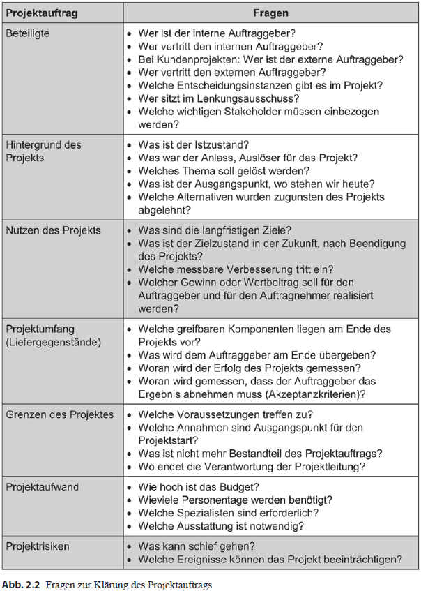
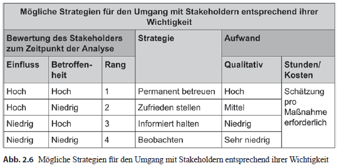
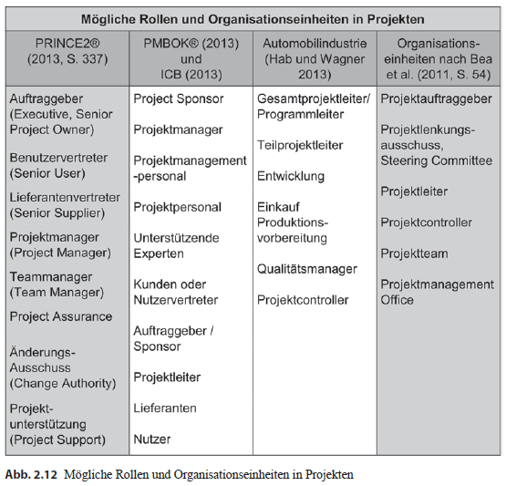
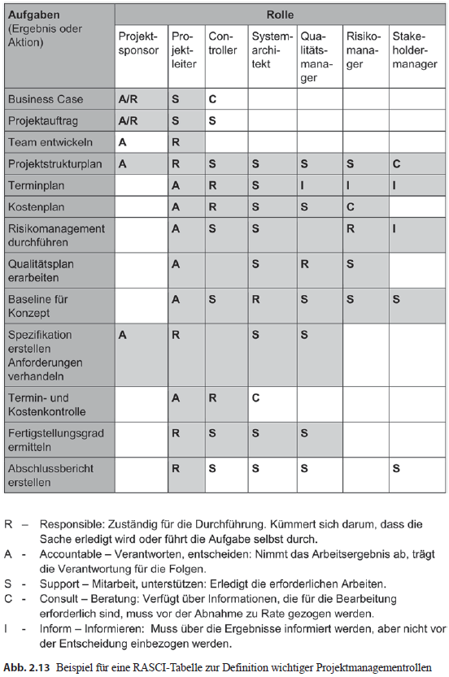

## Kap2: Projekte  definieren
--

- Das Projekt offiziell zu genehmigen & alle dazu notwendigen Schritte durchzuführen

--
- Einen Projektauftrag definieren & alle wichtigen Aspekte schriftlich festhalten

--
- Klärung des Projektumfeldes &rightarrow; Teammitglieder & Stakeholder identifizieren,  
	analysieren & angemessen in das Projekt einbinden

--
- Rollen & Verantwortlichkeiten bilden

---
## Der Projektauftrag

### Die Aufgaben eines Projektauftrages sind:
--
  - die Arbeiten im Projekt zu autorisieren
		& sicherstellen, dass der Auftraggeber die Projekte steuern kann
		
--
  - die Grundlage der Projektdurchführung sollte klar & deutlich definiert werden
  
--
### Welche Aufgabe hat ein interner Projektauftrag?
--
  - Schriftliche Festhaltung aller wichtigen Eckdaten zum Projekt
		&rightarrow; ist eine Vereinbarung zwischen dem internen Auftraggeber & der Projektleitung
		
--
  - Sie ist Ausgangsbasis für alle weiteren Aktivitäten im Projekt
		&rightarrow; insbesondere die Planung & Durchführung des Projekts
		
--
  - Projektleitung & die Teammitglieder haben die Erlaubnis,
		vereinbarte Ressourcen für das Projekt zu verwenden

---
## Projektauftrag
### Wie entsteht der interne Projektauftrag?
--
  - Entsteht mit der Gründung des Business Cases

> **Business Case**:
	&rightarrow; Ist die Darstellung & Abwägung der Erfolgsfaktoren: Kosten, Nutzen & Risiken zum Projekt.
---
## Projektauftrag
### Der Business Case soll folgende Punkte klären:
--
- Warum ist das Projekt sinnvoll?  
--
- Wie passt das Projekt in die existierende Strategie der Organisation?  
--
- Welche Stakeholder sind betroffen & wie stehen Sie zu der Projektidee?  
--
- Welche alternativen Lösungsideen existieren für den identifizierten Bedarf?  
--
- Wie hoch sind Aufwand & erwarteter Nutzen & stehen sie in einem sinnvollen Verhältnis?  
--
- Können wir uns das Projekt leisten, woher kommen die benötigten Ressourcen?  
--
- Verfügen wir über die notwendigen Kompetenzen?  
--
- Welche Risiken & negativen Nebeneffekte sind zu erwarten?  

---
## Projektauftrag
### Ziel der Projektauftragsklärung**
--  
Wenn ein Projektleiter seine:
	- Ziele
	- Aufgaben
	- Rahmenbedingungen
nicht kennt, kann es:
			&rightarrow; enorme negative Auswirkungen auf das Projekt haben
			&rightarrow; erheblichen  wirtschaftlichen Schaden für das Unternehmen nach sich ziehen.
			
---
## Projektauftrag
### Kein Projektstart ohne Projektauftrag!  
--  
Ein Projektstart umfasst drei wichtige Aspekte:  
--
  - die Stakeholder- & Risikoanalyse  
--
  - die Projektbeauftragung  
--
  - die Projekt-Kick-Off-Veranstaltung & den Start-up-Workshop.  
--

- **Projekt-Kick-Off-Veranstaltung:** ist die umfangreichste Informationsveranstaltung zum Projektstart.  
--  
	Ziel:	
			- allen Projektmitgliedern einen gemeinsamen Informationsstand haben  
			- Fragen bezüglich der Rollen im Projekt klären  
--  
- **Kich-off-Veranstaltung:** Der Projektleiter trifft Meeting-Vorbereitungen, die nur die  
grobe Planung der Projektpläne beinhalten & diskutiert die Details mit dem Projektteam.
---
## Projektauftrag  
### Projekt Charter  
--  
  

---
## Projektauftrag
### Fragen zur Klärung des Projektauftrags  
--  

---
## Projektauftrag
### Wann sollte der Projektauftrag verabschiedet werden?  
--  
  - Am Ende der Definitionsphase soll der Projektauftrag beschlossen werden.

---  
## Stakeholdermanagement  

- Projektumfeld & Kooperationskontext müssen geklärt werden  
--  
  &rightarrow;soziale Einflussfaktoren, die Stakeholder des Projekts.  
--  

- **Stakeholder:** sind Interessensgruppen/ -personen, die am Projekt direkt oder indirekt teilnehmen.  
--  

### Warum ist Stakeholdermanagement erforderlich?  
- Kann die Wahrscheinlichkeit des Projekterfolgs erhöhen, indem:  
--  
  - alle Interessensgruppen/-personen identifiziert,
  - analysiert,
  - kategorisiert werden.

---
## Stakeholdermanagement
### Stakeholder können wichtige Informationsquellen sein:
  - für die Definition der Ziele
  - für die Anforderungsanalyse
  - für die Risikomanagement.
  
--
### Die Stakeholder werden in fünf Kategorien eingestuft & stehen unter ständiger Überwachung:  
--  
  - **Förderer**, Befürwörter des Projekts.  
  		&rightarrow; Leisten wichtigen Beitrag: liefern Ressourcen &  
		helfen Anforderungen zu definieren.  
--  
  - **Skeptiker**, sachlich an das Projekt rangehen.  
  		&rightarrow; Liefern Hinweise zum Risikomanagement.  
--  
  - **Opponenten**, Projektgegner.  
  - **Gleichgültige**, wenn Möglich, zur aktiven Mitarbeitern bewegen.  
  		&rightarrow; Können über Informationen & Einflussmöglichkeiten verfügen.  
--  
  - **Neutral**, müssen beobachtet werden, können ihre Position zum Projekt verändern.  

---  
## Stakeholdermanagement  
 
### Wann soll Stakeholdermanagement im Projekt umgesetzt werden?  
   - Stakeholdermanagement soll sehr **früh** Großteil der Arbeit im Projekt erledigen.  
--  
   - Stakeholder dazu bewegen, eine positive, keine ablehnende Haltung einzunehmen.  
--  
   - Es ist wichtig, für jeden Stakeholder folgende Punkte durchzugehen:  
--  
		- Wahrnehmen & nicht ignorieren.  
--  
		- Verstehen, d. h. versuchen, in die Rolle des anderen zu schlüpfen.  
--  
		- Unterstützen, das bedeutet Kontakt aufnehmen & Feedback geben.  
--  
		- Einbeziehen, d. h. in den Projektablauf integrieren.  
--  
		- Zu einer positiven Verpflichtung (Commitment) gegenüber dem Projekt bewegen.  

---  
## Stakeholdermanagement  
### Wie können die Stakeholder identifiziert werden?  
  - früheren Erfahrungswerte der Projektbeteiligten  
  - Gespräche mit dem Auftraggeber  
  - Ermittlung des Einflusses & der Betroffenheit der Stakeholder (Siehe Tab. 2.3)  
  
  

---  
## Stakeholdermanagement  
- **Stakeholderregister** ist ein wichtiges Werkzeug/Dokument, welches alle Informationen über den  
Stakeholder beinhaltet, wie:  
--  
  - Daten über den jeweiligen Stakeholder  
  - Klassifikation  
  - notwendige Strategien, ggf. Maßnahmen  
  
- **Werkzeuge zur Bewertung der Stakeholder**  
Im Laufe der Zeit haben sich zwei Werkzeuge als hilfreich erwiesen:  
--  
  - **Zweidimensionales Portfolio**, die Macht & das Interesse beschreibt.  
--  
  - **Dreidimensionales Portfolio**, wird analysiert, wie stark ist das Potenzial,  
  	das Projekt zu unterstützen oder ihm zu schaden.  

---  
## Stakeholdermanagement
### Zwei-Dreidimensionale Bewertung der Stakeholder

---
## Stakeholdermanagement
- **Stakeholderstrategien** beschreibt die Intensität & die Dauer des Verhaltens,
	welches gegenüber dem Stakeholder betrieben werden soll.
	
- Das spiegelt sich in der Aufwands-, Kosten- & Zeitgründen wieder. (Siehe Abb. 2.6)

---
## Stakeholdermanagement
### Mögliche Strategien-für den Umgang mit dem Stakeholdern

---
## Rollen im Projektmanagement

> In jedem Projekt werden vielfältige Rollen von den Projektmitarbeitern ausgefüllt.  
--  

&rightarrow; Einige der wichtigen Rollen & Organisationseinheiten können sie der Abb 2.12 entnehmen:  
  

---  
## Rollen im Projektmanagement  
### Rolle Klären  

> Eine Rolle ist eine personenunabhängige Bündelung von Aufgaben, Kompetenzen & Verantwortung.  
Sie erfordert bestimmte:  
  	- Fähigkeiten  
	- Kenntnisse  
	- Kompetenzen  

--  
### Die Rollen stellen sicher, dass  
--  
  - die notwendigen Aufgaben erfüllt werden.  
--  
  - die Termine eingehalten werden.  
--  
  - die geforderten Lieferleistungen erfüllt werden.  
--  
  - die Qualität der Lieferleistungen dem gewünschten Ziel entsprechen.  

---  
## Rollen im Projektmanagement  
### Welche Rollen sind wichtig in einem Projekt  
--  
- Da Projekte sehr vielschichtig sind, müssen auch verschiedenste Aspekte betrachtet werden.  
- Im Laufe der Zeit haben sich gewissen Rollen etabliert, die nicht mehr wegzudenken sind.  
--  
- Dazu gehören:  
  - Projektleiter – Project Manager  
  - Projektcontroller – Project Controller  
  - Systemarchitekt – Systems Engineer (Systems Architect), auch Systemverantwortlicher  
  - Qualitätsmanager – Quality Manager  
  - Risikomanager – Risk Manager  
  - Stakeholdermanager – Stakeholder Manager.  

---  
## Rollen im Projektmanagement  
### RASCI-Chart  
--  
- Mit RASCI wird eine Technik zur Analyse & Darstellung von Verantwortlichkeiten bezeichnet.  
--  
- Es handelt sich um eine Matrix, aus der hervorgeht, welche Beteiligten wofür verantwortlich sind.  
--  
Dabei werden folgende Fragen beantwortet:  
- Welche Aufgaben sind zu erledigen?  
- Welche Rollen sind beteiligt?  
- Wer ist wofür verantwortlich?  

---  
## Rollen im Projektmanagement  
### RASCI-Chart  
  
