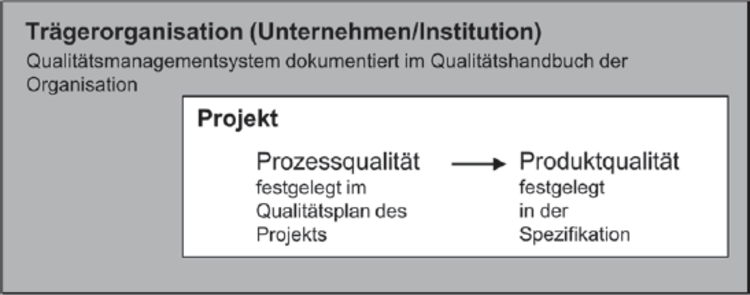
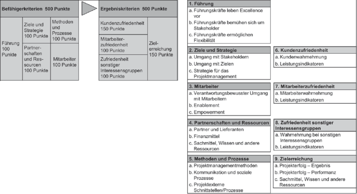
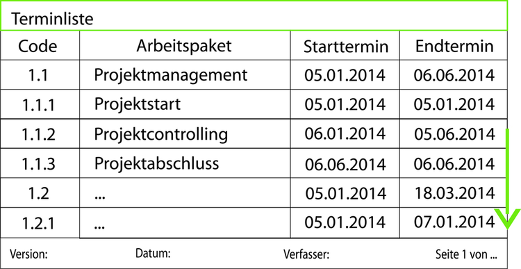
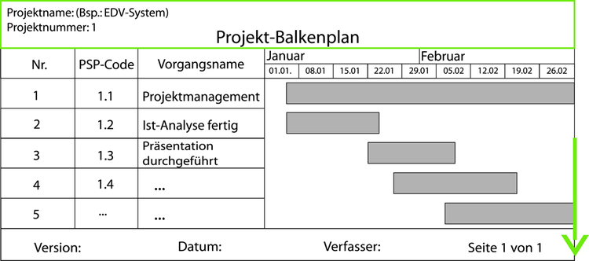
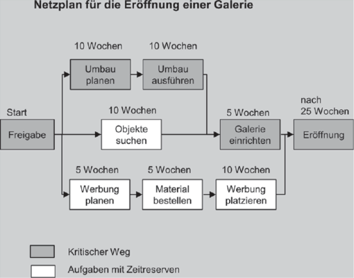
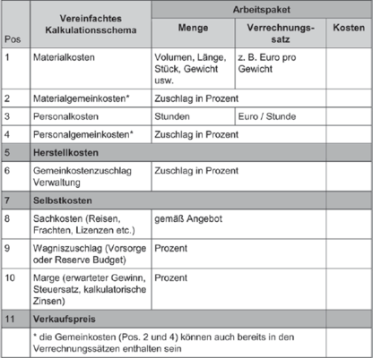

## Qualität planen

--

Wozu Qualität?

--

- Vertrauen

???
- Kunde ist zufrieden

--

- Effizientes Arbeiten

???
- Festes Ziel vorher klar

--

- Weiterbildung

???
- Höherer Aufwand fördert Lernprozess

--

- evtl. Abheben von der Konkurrenz

???
- Wettbewerbsstarke Branchen

---
## Qualität planen

Arten von Qualität:

--

- Produktqualität

???
- Produkt gemäß Anforderungen

--

- Prozessqualität

???
- Gesetzte Qualitätsziele erreicht
- Qualität im Verlauf aufbauen, angefangen mit Planung

---
## Qualität planen

Wie Qualität?

--

Qualitätsziele:

???
- Kann mehr geben als die hier
- Beantworten die Fragen

--

- Wie soll im Projekt gearbeitet werden?

--

- Welche Prioritäten werden gesetzt?

--

- An welchen Kriterien wird Qualität gemessen?

--

&rightarrow; Niedergeschrieben im Qualitätsplan

--

Verantwortlich:
- Qualitätsbeauftragter, oder
- Qualitätshandbuch

???
- Qualitätsmanagement übernimmt
- Handbuch nur mit Erfahrung

---
##Qualität planen

Qualitätsmanagement im Projekt

---
##Qualität planen

Bewertung von Qualität

???
- Sicherstellen des Fortschritts

--

- zu Meilensteinen
- zum Projektende

--

... wie?

--

&rightarrow; Project Excellence Modell

???
- Kriterien zur Bewertung
- Vergeleich mit anderen Projekten
- Objektive Zielerreichung
- Subjektive Eindrücke der Stakeholder

---
##Qualität planen

Das Project Excellence Modell

???
- Projektleiter Selbstbewertung
- Auszeichnung großartiger Leistungen

---
## Projektablauf und Termine planen

Warum Termintreue?

--

&rightarrow; Qualitätsmerkmal

???
- Steigert Zusammenarbeit
- immer hohe, oft höchste Priorität
- Stärkt Vertrauen -> Imageschäden

---
## Projektablauf und Termine planen

Ablauf zu Beginn festgelegt in:

???
- Beginn, Reihenfolge

--

- Meilensteinplan

???
- oder Vertragsterminplan

--

- Masterterminplan

--

- Terminpläne für externe und interne Lieferanten

---
## Projektablauf und Termine planen

Meilensteinplan

???
- Mit Kunde
- Meilensteine aus Sicht des Kunden

--

- Kick-off-Veranstaltung

--

- Wichtige Projektphasen

???
wie Entwicklung o. Durchführung

--

- Reviews- und Übergabetermine

--

- Projektende

--

Kann weitere wichtige Informationen beinhalten!

???
z.B. kundenbezogene, technische oder finanzielle Meilensteine
wv Geld wann bezahlt werden muss

--

**Einmal vereinbart nur schwer änderbar!**

---
## Projektablauf und Termine planen

Masterterminplan

???
- Im Projektteam erarbeitet, nur intern zugänglich

--

- Teilaufgaben

--

- Phasen

--

- Arbeitpakete

--

- Meilensteine

???
Aus Sicht des Teams

---
## Projektablauf und Termine planen

Terminpläne für externe und interne Lieferanten

--

- Stark variabel

--

- Informationen für jeweiligen Teilhaber

???
Wann Teile geliefert, Aufgaben erledigt

--

- Extern: Bestellungen
- Intern: Arbeitsaufträge

???
- ggf. Arbeitspaketbeschreibungen

---
## Projektablauf und Termine planen

Festlegung der Pläne

--

- Aufgabe von Projektcontroller

--

- Meilensteinplan mit Kunde bzw. Projektcharter

--

- Masterterminplan mit Projektteam

--

- Modellierung durch Terminliste, Balkenpläne oder Netzplantechnik

--

- Projektverlauf: Wartung, Änderungen bei Bedarf

---
## Projektablauf und Termine planen

Terminliste

.footnote[
	Bildquelle: http://projektnachwuchs.de/terminliste/
]

???
- Simpel, schnell gemacht
- kleinere Projekte

---
## Projektablauf und Termine planen

Balkenplan

.footnote[
	Bildquelle: http://projektnachwuchs.de/balkenplan/
]

???
- Mittelmaß
- Überlappung möglich
- Abhängigkeiten leicht übersehbar -> logische Pfeile fix

---
## Projektablauf und Termine planen

Netzplantechnik

???
- Oberbegriff vielerlei Methoden
- Netz aus Knoten und Kanten
- Kritischer Weg
- Optionale Pfade: Verzögerungen verschieben Projektende nicht
- Komplexere Projekte, viele Abhängigkeiten
- Hoher Planungsaufwand

---
## Aufwand schätzen und Kosten kalkulieren

???
- Zuverlässigkeit und Präzision
  - Arbeit entlohnen
  - Auswirkung &rightarrow; Magisches Dreieck

--

Zweckerfüllung:

--

- Kalkulation von Projektpreisen

???
bei Auftragsprojekten für externe Kunden

--

- Sicherstellung der Projekteffizienz

--

- Sicherstellung der Projekteffektivität

--

- Life Cycle Costing

---
## Aufwand schätzen und Kosten kalkulieren

Kalkulation von Projektpreisen

--

- Gesamtpreis von Projektbeginn bis Produktübergabe

--

- Zu Beginn festgelegt

???
- Verhandelt zusammen mit Auftraggeber

--

- Meist Preisuntergrenze

???
- Durch harten Wettbewerb
- Weniger geht nicht!

--

&rightarrow; Risiko

???
- Da Offenlegung der Kalkulation
- Risikozuschläge frühzeitig rausgenommen

---
## Aufwand schätzen und Kosten kalkulieren

Projekteffizienz

--

- Projekt hält erwartete Kosten ein

???
- Hinauszögerung von Zielen
&rightarrow; Unvermeidbare Erhöhung der Kosten

--

- Überprüfung: Soll-Ist- und Soll-Wird-Vergleiche

???
- Frühzeitig Schwachstellen finden

---
## Aufwand schätzen und Kosten kalkulieren

Projekteffektivität

???
- misst sich an

--

- Wert des Produkts für Auftraggeber

--

- Ökonomische Beurteilung

???
- Aller wirtschaftlichen Folgen heranziehen

--

- Bei hoher Projekteffektivität evtl. Vorzug vor anderen Projekten

???
- Kunde hat gewissen Eindruck von Kosten/Gewinn

---
## Aufwand schätzen und Kosten kalkulieren

Life Cycle Costing

--

- Kosten über gesamten Lebenszyklus

--

- Entwicklung - Fertigstellung - Produktion/Wartung

--

- Andere langfristige Auswirkungen

---
## Aufwand schätzen und Kosten kalkulieren

Schätzungen aufstellen

--

- Aufgabe mit Zeit bewertet

--

- Zeit mit Geld bewertet

???
- Schwer, da per Definition von Projekten Aufgaben neu sind

--

Einflüsse:

--

- Definition der Liefergegenstände
- Stakeholder- und Risikomanagement
- Requirements Engineering

???
Themen anderer Abschnitte

---
## Aufwand schätzen und Kosten kalkulieren

Schätzungen in drei Schritten:

--

- Top-down grobe Schätzung

--

- Bottom-up Ermittlung der Kosten

--

- Zusammenführung der beiden, festhalten in Kostenplan

???
- akzeptiert

---
## Aufwand schätzen und Kosten kalkulieren

Top-down Schätzung

--

- Früh im Projekt

???
Je eher, desto ungenauer

--

- Erfahrung aus vorherigen Projekten

--

- Globale Daten

--

- Messbare Größen

???
- Gemeint: z.B. Kosten von Haus ableiten
- Vergleichbare Größe, teureres Material...

--

Abhängig von Preisvorstellung des Kunden, Gewinnmarge und Sponsoren

---
## Aufwand schätzen und Kosten kalkulieren

Bottom-up Schätzung

--

- Basiert auf Arbeitspaketen, Material- und Dienstleistungskosten

--

- Individuelle Abschätzung

--

- Projektmitglieder hinzuziehen

???
- Deutlich präzisere Schätzung

--

Übersteigt in der Regel Top-down Schätzung

???
- Nicht unwahrscheinlich um ein Vielfaches

---
## Aufwand schätzen und Kosten kalkulieren

Zusammenführung

--

- Aushandlungsprozess

--

- Management, Kunden und Arbeitspaketverantwortliche

--

- Iterativer Prozess

--

- Festlegung der Kosten

--

Nach Abschluss der Verhandlung liegt Projektbudget fest

???
- Bezugsgröße für Soll-Ist / Soll-Wird Vergleiche über Verlauf des Projekts

---
## Aufwand schätzen und Kosten kalkulieren

Schätzmethoden

???
- wesentlichen zwei Methoden

--

- Expertenschätzung

--

- Berechnung mit Hilfe von mathematischen Gleichungen

---
## Aufwand schätzen und Kosten kalkulieren

Expertenschätzungen

--

- Durch Arbeitspaketverantwortliche(n), oder

--

- Schätzklausur

???
- Fehleinschätzungen minimieren

---
## Aufwand schätzen und Kosten kalkulieren

Expertenschätzung durch Schätzklausur

--

- Teilnehmer:

  - Projektleitung
  - Arbeitspaketverantwortliche
  - (externe Spezialisten)

???
- z.B. Moderator zur methodischen Unterstützung

--

- Vorbereitung:
  - Einladen
  - Arbeitsmaterial bereitstellen
  - Ungestörten Raum finden
  - Pausenversorgung organisieren
  - Verantwortliche für Dokumentation benennen

---
## Aufwand schätzen und Kosten kalkulieren

Expertenschätzung durch Schätzklausur

- Durchführung:

  - Begrüßung
  - Arbeitspaketverantwortliche stellen Arbeitspaket vor
  - Teilnehmer schätzen Zeitaufwand individuell
  - Abweichungen diskutieren
  - Ergebnis dokumentieren

--

- Nachbereitung:
  - Ergebnisse fertigstellen und Rückmeldungen an Teilnehmer schicken

???
- Erfahrungsgemäß präzise Ergebnisse

---
## Aufwand schätzen und Kosten kalkulieren

Berechnung mit mathematischen Gleichungen

???
- Zwei Methoden

--

- Parametrische Methode:

--

  - Regressionsanalyse abgeschlossener Projekte

???
- Ziel: Entwicklung von Algorithmen zur präziseren Bestimmung des Aufwands

--

  - Kompliziert

--

  - Zugriff auf umfangreiche Kostendatenbanken benötigt

--

  - Nicht für kleine/mittelgroße Projekte

---
## Aufwand schätzen und Kosten kalkulieren

Berechnung mit mathematischen Gleichungen

- Multiplikator Methode:

--

  - Messbare Eigenschaften

--

  &rightarrow; Schließen auf eigene Produktionsgröße

--

  - Linearer Zusammenhang

--

  - Unpräzise!

???
- Haus: doppelt so groß, doppelt so teuer? &rightarrow; größere Projekte, größere Hindernisse
- Spezielle Materialien? Genehmigungen?

---
## Aufwand schätzen und Kosten kalkulieren

Kosten kalkulieren

???
- Abschließend an alle Schätzungen

--

- Plankosten

--

- Annahme: Keine Fehler

???
- Risikozuschläge außen vor gelassen

--

- Nicht nur Personalkosten

---
## Aufwand schätzen und Kosten kalkulieren

Plankosten

- Personalkosten

--

- Materialkosten

--

- Sachkosten:
  - Unteraufträge
  - Beratungskosten
  - Lizenzkosten
  - Mieten/Reisekosten

--

- Betriebsmittelkosten für Maschinen und Anlagen

--

- Kapitalkosten:
  - Abschreibungen
  - Wagniszuschläge
  - Steuern/Zinsen

---
## Aufwand schätzen und Kosten kalkulieren

Unterteilung von Positionen

???
- In manchen Projekten gefordert
- Arbeitspakete nicht mit gleich viel Geld bewertet

--

- Geschäftsführer
- Projektleiter
- Techniker
- Sekretariat

---
## Aufwand schätzen und Kosten kalkulieren

Mögliche Positionen für die Kalkulationen eines Arbeitspakets

