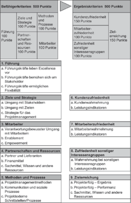

## Qualität planen

--

Wozu Qualität?

--

- Vertrauen

???
Kunde ist zufrieden

--

- Effizientes Arbeiten

???
Festes Ziel vorher klar

--

- Weiterbildung

???
Höherer Aufwand fördert Lernprozess

--

- evtl. Abheben von der Konkurrenz

???
Wettbewerbsstarke Branchen

---
## Qualität planen

Arten von Qualität:

--

- Produktqualität

???
Produkt gemäß Anforderungen

--

- Prozessqualität

???
Gesetzte Qualitätsziele erreicht
Qualität im Verlauf aufbauen, angefangen mit Planung

---
## Qualität planen

Wie Qualität?

--

Qualitätsziele:

???
Kann mehr geben als die hier
Beantworten die Fragen

--

- Wie soll im Projekt gearbeitet werden?

--

- Welche Prioritäten werden gesetzt?

--

- An welchen Kriterien wird Qualität gemessen?

--

&rightarrow; Niedergeschrieben im Qualitätsplan

--

Verantwortlich:
- Qualitätsbeauftragter, oder
- Qualitätshandbuch

???
Qualitätsmanagement übernimmt
Handbuch nur mit Erfahrung

---
##Qualität planen

---
##Qualität planen

Bewertung von Qualität

???
Sicherstellen des Fortschritts

--

- zu Meilensteinen
- zum Projektende

--

... wie?

--

&rightarrow; Project Excellence Modell

???
Kriterien zur Bewertung
Vergeleich mit anderen Projekten
Objektive Zielerreichung
Subjektive Eindrücke der Stakeholder

---
##Qualität planen

???
Projektleiter Selbstbewertung
Auszeichnung großartiger Leistungen

---
## Projektablauf und Termine planen

Warum Termintreue?

--

&rightarrow; Qualitätsmerkmal

???
Steigert Zusammenarbeit
immer hohe, oft höchste Priorität
Stärkt Vertrauen -> Imageschäden

---
## Projektablauf und Termine planen

Ablauf zu Beginn festgelegt in:

???
Beginn, Reihenfolge

--

- Meilensteinplan

???
oder Vertragsterminplan

--

- Masterterminplan

--

- Terminpläne für externe und interne Lieferanten

---
## Projektablauf und Termine planen

Meilensteinplan

???
Mit Kunde
Meilensteine aus Sicht des Kunden

--

- Kick-off-Veranstaltung

--

- Wichtige Projektphasen

???
wie Entwicklung o. Durchführung

--

- Reviews- und Übergabetermine

--

- Projektende

--

Kann weitere wichtige Informationen beinhalten!

???
z.B. kundenbezogene, technische oder finanzielle Meilensteine
wv Geld wann bezahlt werden muss

--

**Einmal vereinbart nur schwer änderbar!**

---
## Projektablauf und Termine planen

Masterterminplan

???
Im Projektteam erarbeitet, nur intern zugänglich

--

- Teilaufgaben

--

- Phasen

--

- Arbeitpakete

--

- Meilensteine

???
Aus Sicht des Teams

---
## Projektablauf und Termine planen

Terminpläne für externe und interne Lieferanten

--

- Stark variabel

--

- Informationen für jeweiligen Teilhaber

???
Wann Teile geliefert, Aufgaben erledigt

--

- Extern: Bestellungen
- Intern: Arbeitsaufträge

???
ggf. Arbeitspaketbeschreibungen

---
## Projektablauf und Termine planen

Festlegung der Pläne

--

- Aufgabe von Projektcontroller

--

- Meilensteinplan mit Kunde bzw. Projektcharter

--

- Masterterminplan mit Projektteam

--

- Modellierung durch Terminliste, Balkenpläne oder Netzplantechnik

--

- Projektverlauf: Wartung, Änderungen bei Bedarf

---
## Projektablauf und Termine planen

Terminliste

???
Simpel, schnell gemacht
kleinere Projekte

