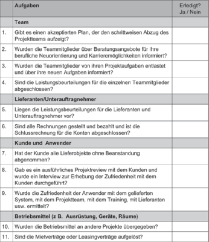

## Projekt abschließen

Abschlussphase

--

- Letzte Phase im Projekt

--

- Produkt ist bereits übergeben

--

- Abschließenden Aufgaben fangen an:

--

  - Beziehungsebene
  - Sachebene

---
## Projekt abschließen

Beziehungsebene

--

- Neuorientieren

--

- Bilanzieren

--

- Sich-Besinnen

--

- Erfahrungen austauschen

--

- Abschied nehmen

---
## Projekt abschließen

Sachebene

--

---
## Projekt abschließen

--

- Projektauswertung

--

- Projektnachkalkulation

--

- Abschlussbericht

---

## Projekt abschließen

Projektauswertung

--

- Frage: Wurden Ziele erreicht?

???
- Beziehungseben und Sacheben einbeziehen

--

- Sachebene: Kosten, Zeit, Leistungsumfang, Qualität &rightarrow; eingehalten?

--

- Beziehungseben: Meinungen wichtiger Stakeholder einholen

---
## Projekt abschließen

Projektnachkalkulation

???
- Beurteilung der Wirtschaftlichkeit des Projekts
- wertvolle Erfahrungen und Informationen für zukünftige Projekte

--

- Budget

--

- Mehrleistung

--

- Minderleistungen

--

- Revidiertes Budget

--

- Ist-Kosten

--

- Abweichung

--

- Begründung

---
## Projekt abschließen

Abschlussbericht

???
- Alle Informationen die Erfolgschancen zukünfitger Projekte steigern könnten

--

- Erweiterung o. Neuanlegung von Checklisten

--

- Identifizieren neuer Risiken o. Stakeholder

--

- Anpassungen von Standardphasenplänen, -strukturplänen, -berichten, -formaten

--

- Verbesserungen der Qualitätsziele

---
## Projekt abschließen

Die Zukunft

--

- Einpflege der Änderungen

--

&rightarrow; Projektmanagementoffice

???
- sorgfältig erfüllt: Zukunft gesichert
- Iterative Verbesserung

--

- Systematische Verbesserung von Projektmanagement selbst