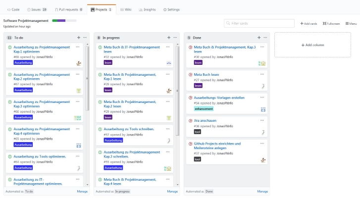
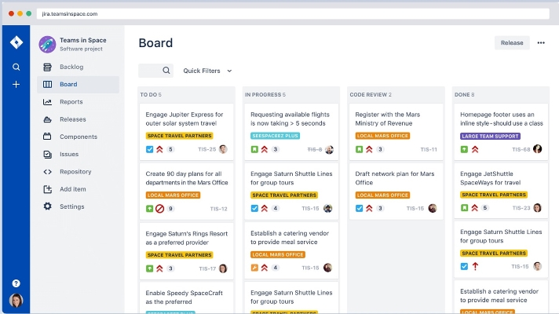
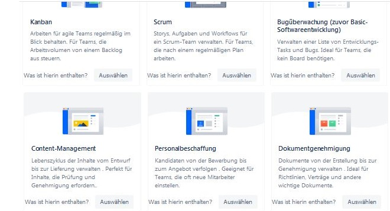
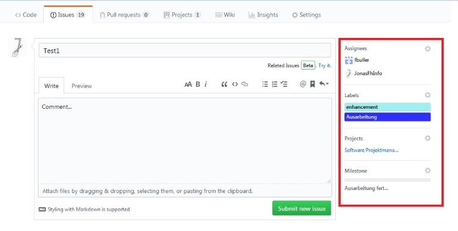
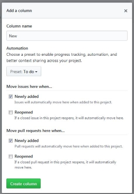
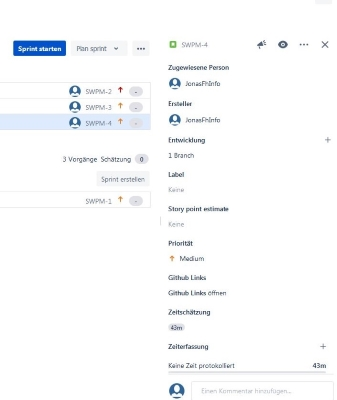
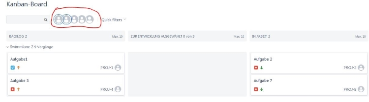
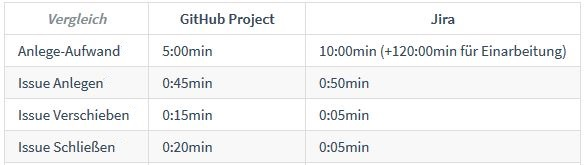
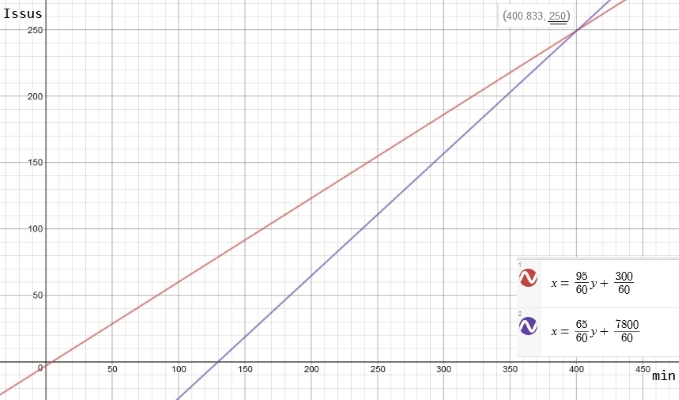
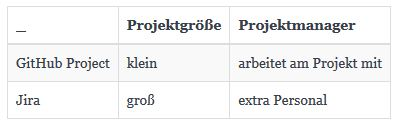

## Tooling

1. Kurzvorstellung
2. GitHub Project
3. Jira
4. Zeit Vergleich

???
* GitHub Project & Jira Vortellen
* Aus Sicht: GitHub erfahrenen
* Zeigen was was kann
* Ab wann sich Jira lohnt
---

### Kurzvorstellung: GitHub Project

???
* Direkt im GitHub Repo.
* Bietet Dashboard, mit Issues & Milestones

---

### Kurzvorstellung: Jira

.footnote[
	Bildquelle: https://de.atlassian.com/software/jira
]

???
- Kostenpflichtige Software: von Atlassian
- Zusätzliche Dinge: für Projektmangement
- _
- Vorlagen: für Personalbeschaffung

---

### Kurzvorstellung: Jira
    

???
* Vorlagen Auswahl

---
### GitHub Project

???
* Erlaub es Dashbords anzulegen
* Verwendet Issues (mit Labels + Zuteilung)
* Milestone Balken oben-links

---
### GitHub Project: Issues

???
* Issues zum Project Zuteilen 

---
### GitHub Project: Automatisierung

???
- Weiterer Vorteil: Spalten mit Automatisierung
- _
- Das wars
- _
- Selbst der Filter verlangt Texteingabe

---
### GitHub Project: Filter

???
- Filter

---
### Jira

.footnote[
	Bildquelle: https://de.atlassian.com/software/jira
]

???
* Erlaub umfangreichere Dashboads
* Projektmangement Einbinden (zb Confluence, BitBucket)
* Sehr unübersichtlich
* FRAGEN wo man glaubt neue Issues anzulegen.
* _
* Umfangreiche Dashboards -> Umfangreichere Issues

---
### Jira: Issues

???
* Zeitschätzung & Prio, wo Project nur Milestones(Zeit) & Label hat.

---
### Jira: Filter

???
* Schnellere Sortierung, Gegensatz zu Texteingabe
* Laden neuer Seiten kann 10-20 sek dau

---
### Zeit Vergleich 
  
  
  

???
- Lange Einarbeitung
- Zeitarsparniss durch Filter & Alles auf einer Seite
- Lohnt sich ab 10/250 Issues

---
### Zeit Vergleich 

---
### Abschluss

Frage: Wie groß ist das Projekt und wer managt es?

???
* GitHub Project 
* kleines, übersichtliches Projekt
* bei dem Projektmanger mitarbeited
* Fokus: auf Nähe zur Arbeit
* _
* Jira
* großes Projekt, mit viel Projektmangement
* Extra Personal 
* Fokus: auf Nähe zu Projektmangement Unterlagen

--
count: false

